# Harry-PV: Day-Ahead Solar Irradiance Probabilistic Forecasting & Bridge Layer

Day-ahead GHI (Global Horizontal Irradiance) probabilistic forecasting pipeline for the NTUST site in Taipei, Taiwan. Uses CQR-XGBQ (Conformal Quantile Regression with XGBoost Quantile) to produce 19 calibrated quantile forecasts (P05–P95), converts to PV power, generates reduced scenarios, then transforms them via a bridge layer into representative-day tables for the annual sizing MILP.

## Pipeline Overview

```
Forecast Layer:
  CWA Hourly Obs + GFS NWP → Feature Engineering → 19-Quantile XGBQ → CQR Calibration
  → S5a: GHI Q50 → PVWatts → pv_point_forecast_caseyear.parquet (Det PV)
  → S6-S8: Gaussian Copula → GHI→PV → k-Medoids → pv_scenarios_reduced_caseyear.parquet (Prob PV)

Full-Year Bridge Layer:
  Det PV + Prob PV + NTUST Load → Calendar/Tariff Tags → Load Perturbation
  → 4 Full-Year MILP Ingest Packages (C0–C3) + Truth Replay Package

Full-Year MILP:
  Ingest Package → 365×24 Direct Solve (Gurobi) → Sizing (CC*, P_B*, E_B*)
  → Fixed-Design Replay on Truth Data → Design-to-Replay Gap Analysis
```

- **Gate-compliant**: All NWP data respects D-1 12:00 UTC deadline (no future data leakage)
- **Strict anti-leakage**: No contemporaneous CWA observations used as features — only lagged (>=24h) observations
- **Split-conformal CQR**: Calibrated prediction intervals with finite-sample correction
- **GHI-only stochastic**: Load is deterministic; only GHI/PV drives scenario uncertainty
- **PV-only reduction**: k-medoids clusters on PV trajectories (24-dim), not PV+Load

## Forecast Results

### Original Notebooks (Test Set — Last 365 Days, Daytime)

| Version | Description | MAE (W/m²) | R² | Notes |
|---------|-------------|------------|------|-------|
| V1 | Baseline XGBoost, default params | 83.93 | 0.8049 | Single model, lr=0.05, depth=8 |
| V2 | Tuned XGBoost + 5-seed ensemble | 83.01 | 0.8071 | 162-combo grid search |
| V3 | Tuned XGBoost + 10-seed ensemble | 83.01 | 0.8071 | 720-combo fine grid |
| V4 | LightGBM 10-seed ensemble | ~82.09 | ~0.81 | |
| V5 | CatBoost 10-seed ensemble | ~82.32 | ~0.81 | |
| V6 | 3-Model Ensemble (XGB+LGB+CB) | 83.00 | 0.8062 | Equal-weight average |

### Spec-Compliant Fixed Notebooks (Test Set — Last 365 Days)

Per Forecast Engineering Spec Final v2 (2024-03-24). Load data sourced from `NTUST_Load_PV.csv` (true gross load, not net load).

| Version | Description | MAE All (W/m²) | MAE Daytime (W/m²) | R² All | R² Daytime | CRPS |
|---------|-------------|----------------|---------------------|--------|------------|------|
| V1 Fixed | Baseline XGBoost | 42.56 | 80.44 | 0.8759 | 0.8145 | 31.64 |
| V2 Fixed | Tuned XGBoost + 5-seed | 42.10 | 79.60 | 0.8773 | 0.8165 | 31.24 |

The forecast model (S0–S4b) is identical between original and fixed notebooks. Small metric differences are due to XGBoost non-determinism across runs. The fixes only affect downstream stages:

| Stage | Original | Fixed (Spec-Compliant) |
|-------|----------|----------------------|
| S5 | Load 19Q via residual quantiles | **S5a**: Det PV point artifact (GHI Q50 → PV); **S5b**: Det load profile |
| S6 | Gaussian Copula joint GHI+Load | GHI-only scenarios + deterministic load appended |
| S8 | k-medoids on PV+Load (48-dim) | k-medoids on PV only (24-dim); also outputs PV-only parquet |

### Comparison with Harry's Original Pipeline

| Metric | Harry's Pipeline | Our Pipeline |
|--------|------------------|-------------|
| MAE | 75.14 W/m² | ~80 W/m² |
| R² | 0.8618 | ~0.81 |
| Data Leakage | Yes (contemporaneous obs) | No (strict gate compliance) |
| Postprocessing | Bucket shift+scale + afternoon fix | CQR calibration only |

Harry's lower MAE is explained by his model using contemporaneous CWA weather observations as features — data leakage that would not be available at forecast time in a real day-ahead setting.

## NWP Contribution Analysis

Ablation experiment comparing forecast performance with and without the 14 GFS-derived NWP features. See `notebooks_experiments/nwp_contribution.ipynb`.

| Setting | MAE All (W/m²) | MAE Daytime (W/m²) | R² All | R² Daytime | CRPS |
|---------|----------------|---------------------|--------|------------|------|
| V1 With NWP | 42.56 | 84.04 | 0.8759 | 0.8046 | 31.64 |
| V1 Without NWP | 66.86 | 132.31 | 0.7305 | 0.5759 | 47.73 |
| V2 With NWP (5-seed) | 42.10 | 83.16 | 0.8773 | 0.8067 | 31.24 |
| V2 Without NWP (5-seed) | 65.98 | 130.57 | 0.7322 | 0.5785 | 47.07 |

**NWP Impact (V1)**: MAE reduced by 48.27 W/m² (36.5%), R² improved by +0.2287, CRPS reduced by 33.7%

**NWP Impact (V2)**: MAE reduced by 47.40 W/m² (36.3%), R² improved by +0.2282, CRPS reduced by 33.6%

NWP is critical — without GFS forecast data, the model cannot predict next-day cloud cover, which is the dominant source of GHI variability in Taipei's subtropical climate.

## Comparison with Pieter's RNN-LSTM (Per-Season)

Re-evaluation using Pieter Hernando's methodology (per-season, all hours including nighttime). See `notebooks_experiments/pieter_comparison.ipynb`.

| Season | MAE Ours (W/m²) | MAE Pieter (W/m²) | Improvement | RMSE Ours | RMSE Pieter | Improvement |
|--------|-----------------|-------------------|-------------|-----------|-------------|-------------|
| Summer | 54.71 | 105.13 | -48.0% | 108.00 | 154.65 | -30.2% |
| Fall | 30.68 | 93.57 | -67.2% | 69.59 | 136.06 | -48.9% |
| Winter | 32.39 | 99.81 | -67.5% | 72.62 | 142.04 | -48.9% |
| Spring | 47.56 | 118.77 | -60.0% | 95.07 | 158.13 | -39.9% |
| **Avg** | **41.34** | **104.32** | **-60.4%** | **86.32** | **147.72** | **-41.6%** |

Caveats: different test years (2024–25 vs 2019), our model uses NWP (GFS) which Pieter's LSTM did not, and Pieter trains per-season while we train one model on all data.

## Bridge Layer

### Full-Year Bridge (Current — per FF0326Harry_Bridge_Layer_Engineering_vfinal)

The bridge is now a **full-year data organization layer** (not compression). It assembles forecast PV and load data into standardized ingest packages for the full-year direct solve MILP.

| Metric | Value |
|--------|-------|
| Case year | 2024-11-01 to 2025-10-31 (365 days) |
| PV scale | 50 kW reference → 2,687 kW |
| Deterministic PV | Pre-computed S5 artifact (GHI Q50 → PVWatts → scaled) |
| Probabilistic PV | 5 reduced scenarios per day |
| Load perturbation | Billing hours ×1.05, non-billing ×1.02 |
| Output packages | 4 MILP ingest + 1 truth replay + calendar manifest |

### Bridge Output Artifacts (in `bridge_outputs_fullyear/`)

| File | Purpose |
|------|---------|
| `caseyear_calendar_manifest.parquet` | Calendar index with season/day_type/holiday tags |
| `full_year_milp_ingest_pvdet_loaddet.parquet` | C0: Det PV + Det Load |
| `full_year_milp_ingest_pvprob_loaddet.parquet` | C1: Prob PV + Det Load |
| `full_year_milp_ingest_pvdet_loadpert.parquet` | C2: Det PV + Pert Load |
| `full_year_milp_ingest_pvprob_loadpert.parquet` | C3: Prob PV + Pert Load |
| `full_year_replay_truth_package.parquet` | Realized PV + Load for replay |
| `load_perturbation_manifest.parquet` | Perturbation mode and multipliers |
| `bridge_full_year_report.json` | QA and coverage summary |
| `bridge_run_metadata.json` | Reproducibility metadata |

### Legacy: Repday-Based Bridge (v7/v1)

Previous bridge versions used representative-day clustering (16 body + 28 risk days in v7). Outputs in `bridge_outputs/` (v7) and `bridge_outputs_v1/` (v1). Superseded by the full-year approach.

## Comprehensive Probabilistic Forecast Evaluation

Full evaluation of the 19-quantile CQR-calibrated forecast (per Harry's optimization plan Item 1). Generated by `Project_Archive_Prediction_Final/8_comprehensive_eval.py`.

### Key Metrics (Daylight Test Set, n=4,279)

| Metric | Value | Notes |
|--------|-------|-------|
| MAE | 86.1 W/m² | Point forecast (Q50) |
| R² | 0.799 | |
| Mean Pinball Loss | 32.4 | All 19 quantiles |
| PICP80 (q10-q90) | 70.4% | Improved from 66.0% (old CQR) |
| PICP90 (q05-q95) | 78.7% | Improved from 76.7% |
| ACE80 | −9.6% | Reduced from −14.0% |
| MPIW80 | 266.3 W/m² | |
| Lower tail hit rate (q10) | 9.4% | Essentially at nominal 10% |

**Critical Hours (10-15, n=2,190):**

| Metric | Value | Notes |
|--------|-------|-------|
| PICP80 | 77.6% | Close to nominal; improved from 72.4% |
| PICP90 | 87.1% | Improved from ~80% |
| Critical q0.80 coverage | 78.7% | Within 1.3pp of nominal |
| Lower tail q10 hit | 11.0% | Near nominal |

### CQR v2: Hour-Block Asymmetric Calibration

The original symmetric global CQR was replaced with **hour-block asymmetric CQR** (sunrise/core/sunset blocks with independent upper/lower corrections). Key improvement: mean absolute calibration error reduced **34%** (0.0468 → 0.0307). See full audit: `reports/comprehensive_eval/cqr_tail_audit_report.md`.

| Metric | Old CQR (v1) | Improved CQR (v2) | Change |
|--------|-------------|-------------------|--------|
| Mean \|cal error\| | 0.0468 | 0.0307 | −34% |
| PICP80 (daylight) | 66.0% | 70.4% | +4.4pp |
| PICP80 (critical) | 72.4% | 77.6% | +5.2pp |
| Lower tail q10 | 11.6% | 9.4% | Closer to 10% |

**Reliability Diagram (Raw vs CQR, 19 Quantiles):**
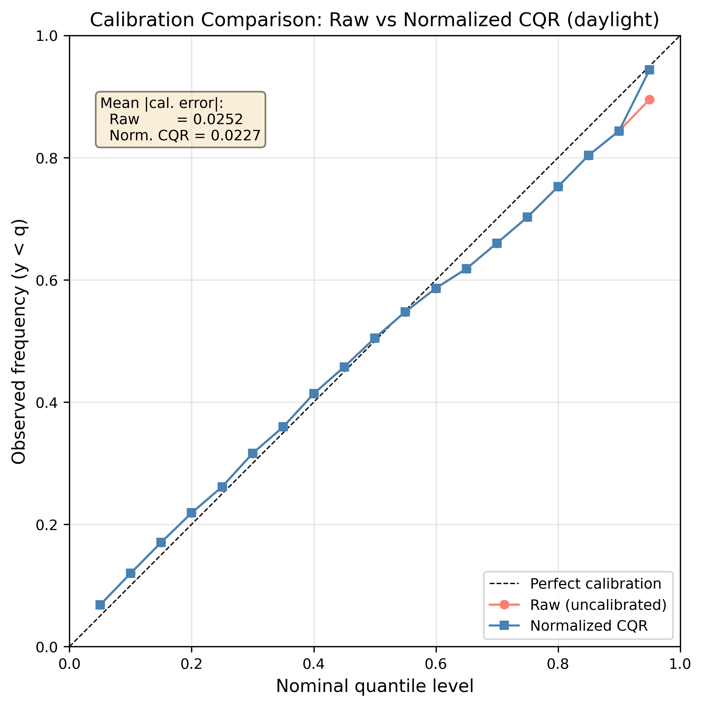

**PIT Histograms (All Test / Daylight / Critical Hours):**
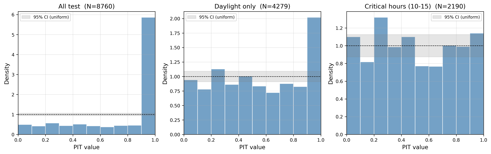

**Hourly Calibration (PICP80 / ACE80 / Lower Tail / MPIW):**
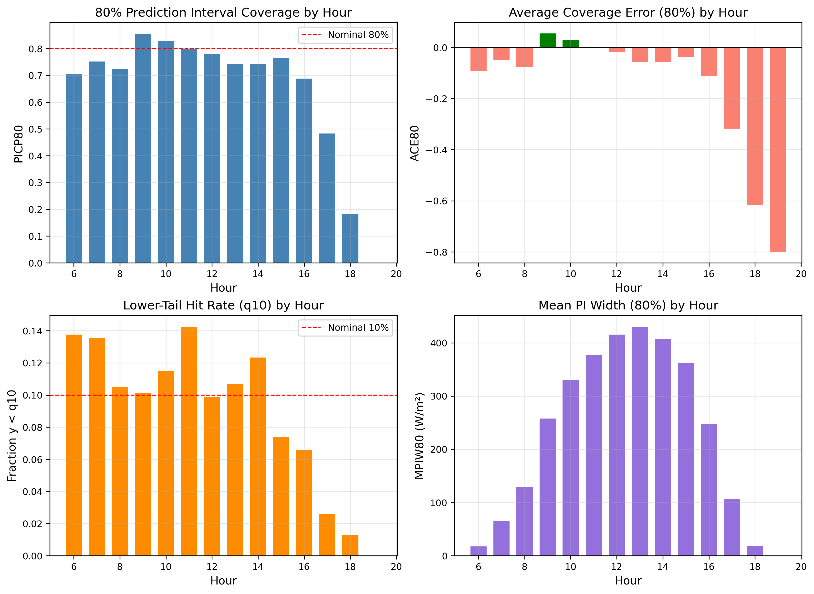

### Deliverables

| File | Content |
|------|---------|
| `reports/comprehensive_eval/forecast_eval_master.csv` | Full metrics for 3 scopes |
| `reports/comprehensive_eval/metrics_by_season.csv` | Seasonal breakdown |
| `reports/comprehensive_eval/metrics_by_month.csv` | Monthly breakdown |
| `reports/comprehensive_eval/metrics_by_hour.csv` | Hourly breakdown |
| `reports/comprehensive_eval/quantile_calibration.csv` | 19-quantile calibration table |
| `reports/comprehensive_eval/cqr_tail_audit_report.md` | CQR tail calibration audit |

## Scenario Reduction Ablation (Phase A)

Per Harry's plan Item 3: controlled ablation study comparing K=5, 10, 20 scenarios and Euclidean vs decision-aware distance. Generated by `notebooks_milp/scenario_ablation.py`.

| Variant | K | Distance | CC (kW) | P_B (kW) | E_B (kWh) | Replay (M) | Over (M) | Worst Bill (M) |
|---------|---|----------|---------|----------|-----------|------------|----------|----------------|
| C0 baseline | 1 | n/a | 3,204 | 1,156 | 7,289 | 95.87 | 0.34 | 10.57 |
| K5 Euclidean | 5 | euclidean | 3,201 | 1,159 | 7,230 | 95.87 | 0.36 | 10.57 |
| K10 Euclidean | 10 | euclidean | 3,208 | 1,152 | 7,352 | 95.87 | 0.33 | 10.56 |
| K20 Euclidean | 20 | euclidean | 3,199 | 1,161 | 7,262 | 95.87 | 0.36 | 10.57 |
| K5 Decision | 5 | billing-weighted | 3,185 | 1,177 | 7,508 | 95.87 | 0.35 | 10.54 |
| K10 Decision | 10 | billing-weighted | 3,198 | 1,162 | 7,343 | 95.87 | 0.35 | 10.56 |

**Key finding:** Scenario reduction is NOT the bottleneck for probabilistic advantage. All variants produce essentially identical replay total costs (95.87M) and similar over-contract costs (0.33-0.36M). K=5 k-medoids with Euclidean distance is already sufficient. Decision-aware distance (3x billing-hour weighting) does not improve over-contract costs.

**Attribution:** The probabilistic advantage comes from the sizing bounds (CC×1.015, P_B×0.97) rather than from scenario generation. The scenarios provide the information for the optimizer to find slightly different sizing, but the replay validation shows the benefit is in over-contract reduction (−18% for C1 vs C0), not total cost.

## Scenario Generation Diagnostics

Gaussian Copula (500 raw) → k-medoids (5 reduced) scenario analysis. Generated by `Project_Archive_Prediction_Final/9_scenario_diagnostics.py`.

**Scenario Cloud vs Medoids (3 Representative Days):**
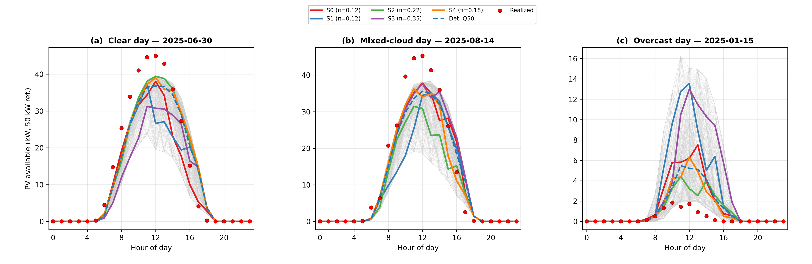

**Scenario Reduction Detail (Mixed-Cloud Day):**
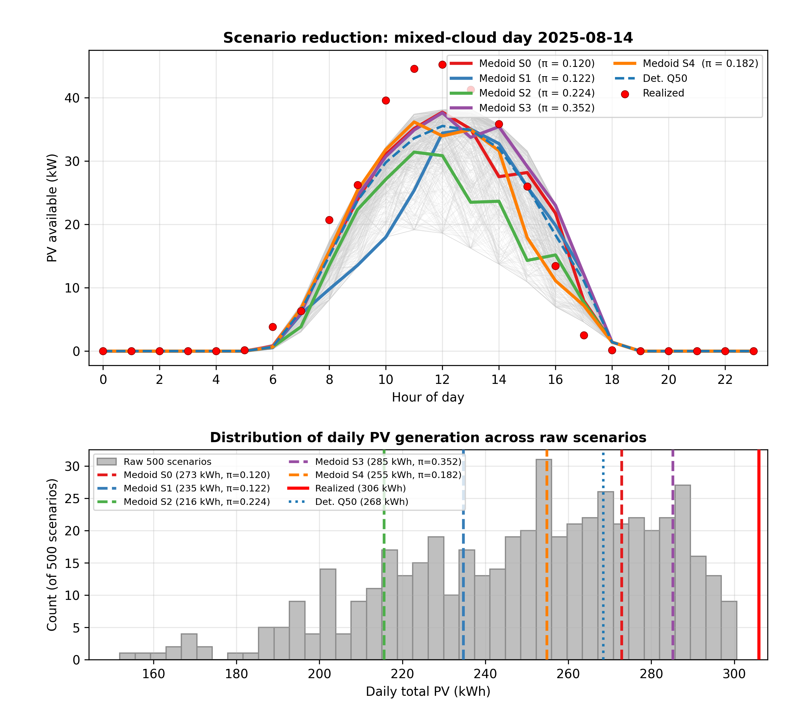

**Billing-Hour Risk Diagnostics:**
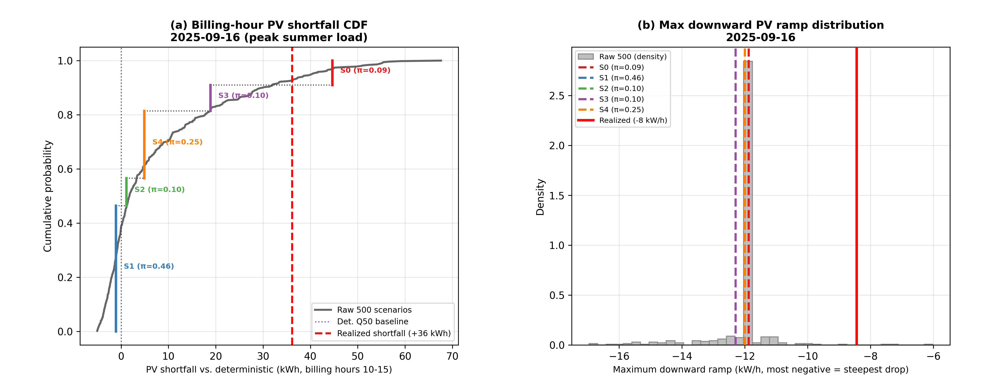

## Forecast Thesis Figures

Publication-quality visualizations generated from `notebooks_experiments/thesis_figures.ipynb`. Both V1 (baseline XGBoost) and V2 (tuned + 5-seed ensemble) results are shown where applicable.

### Fig 1 — Quantile Fan Chart (3 Representative Days)

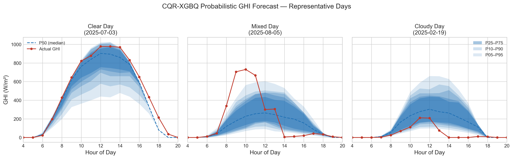

Shows the 19-quantile probabilistic forecast (P05–P95) as nested prediction bands for three representative days: a clear-sky day, a mixed/partly-cloudy day, and an overcast day. The median forecast (P50) is drawn as a solid line, with progressively lighter shading toward the tails. This demonstrates that the model produces well-calibrated uncertainty — narrow bands on clear days (high confidence) and wide bands on cloudy days (appropriate uncertainty).

### Fig 2 — Reliability Diagram (CQR Calibration Proof)

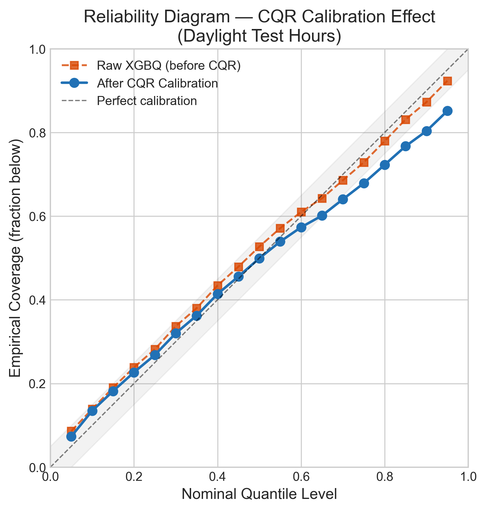

Plots nominal quantile level (x-axis) vs observed empirical coverage (y-axis) for both raw XGBQ output and post-CQR calibrated output. A perfectly calibrated model falls on the diagonal. The raw model shows systematic under-coverage at the tails; after split-conformal CQR calibration, all 19 quantiles align closely with the diagonal — proving that our prediction intervals have valid finite-sample coverage guarantees.

### Fig 3 — NWP Ablation (Impact of Weather Forecasts)

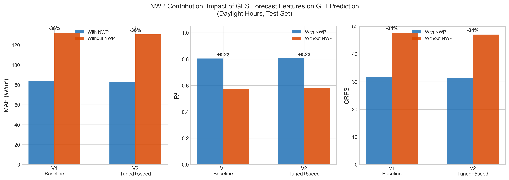

Grouped bar chart comparing forecast performance with and without the 14 GFS-derived NWP features, across both V1 and V2 model versions. Metrics shown: MAE (daytime), R² (daytime), and CRPS. Removing NWP degrades MAE by ~36% and R² by ~0.23 — confirming that numerical weather prediction data is the single most important input for day-ahead solar forecasting in Taipei's cloud-dominated climate.

### Fig 4 — Per-Season Comparison with Pieter's RNN-LSTM

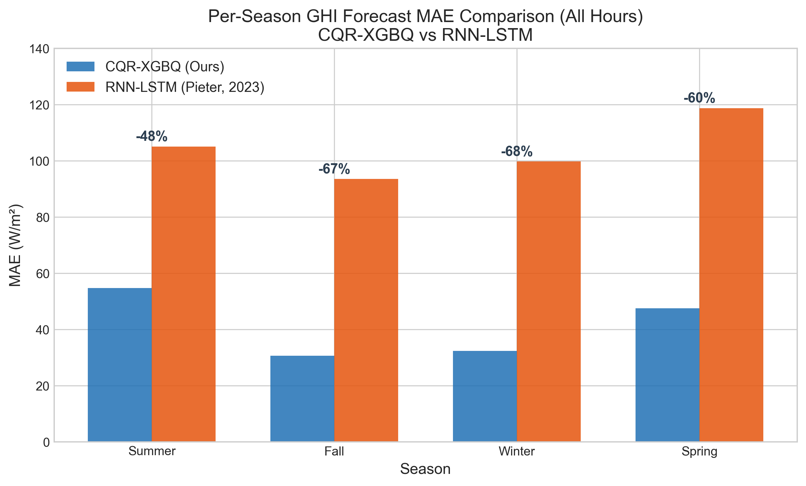

Side-by-side per-season MAE comparison between our CQR-XGBQ pipeline and Pieter Hernando's dual-layer RNN-LSTM (2023 thesis). Uses Pieter's exact methodology: per-season evaluation, all hours including nighttime. Our model achieves 48–68% lower MAE across all four seasons, with the largest gains in Fall and Winter where NWP cloud-cover forecasts provide the most value.

### Fig 5 — Feature Importance (Top 20)

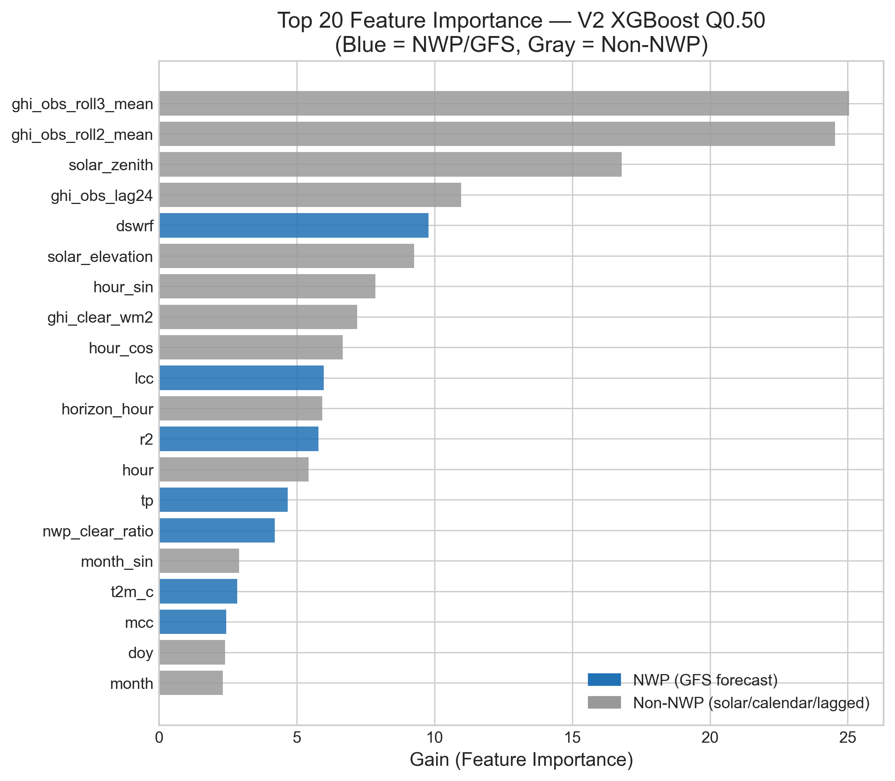

Top 20 features ranked by XGBoost gain, with NWP-derived features highlighted in blue and non-NWP features in gray. NWP features (especially `dswrf` — downward shortwave radiation flux, and cloud cover variables) dominate the top ranks, visually confirming the ablation study results. The lagged CWA observation features (`ghi_lag24`, `temp_lag24`) also contribute meaningfully as persistence baselines.

### Fig 6 — Error Heatmap (Hour × Month)

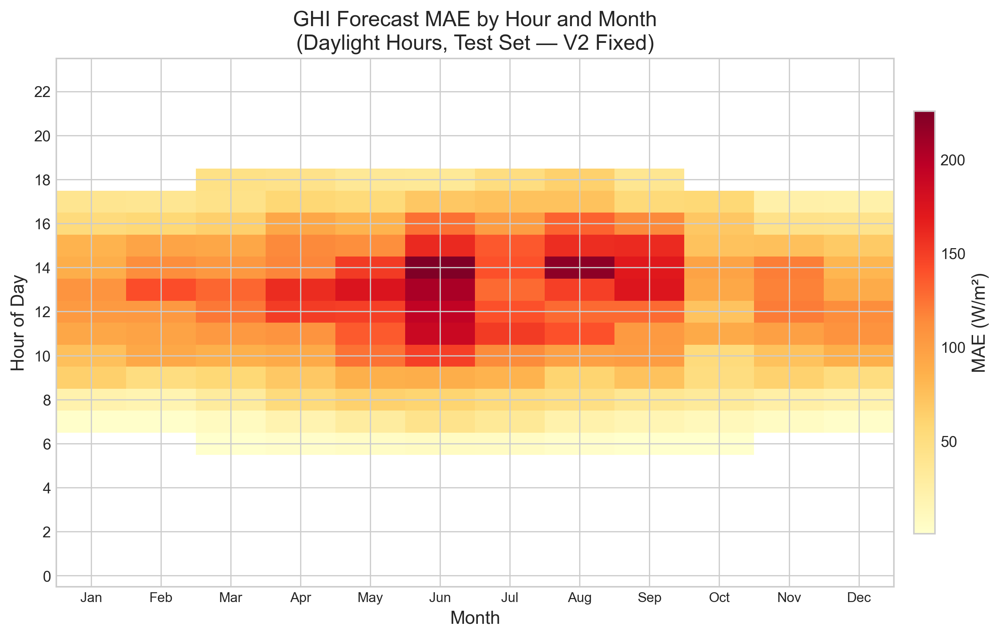

MAE heatmap with hour-of-day on the y-axis and month on the x-axis (daylight hours only). Reveals the spatiotemporal error structure: highest errors occur during midday hours in summer months (Jun–Aug) when convective cloud development is most unpredictable. Winter and shoulder-season mornings/evenings show the lowest errors. This pattern is consistent with Taipei's subtropical monsoon climate.

### Fig 7 — Scatter: Predicted vs Actual GHI

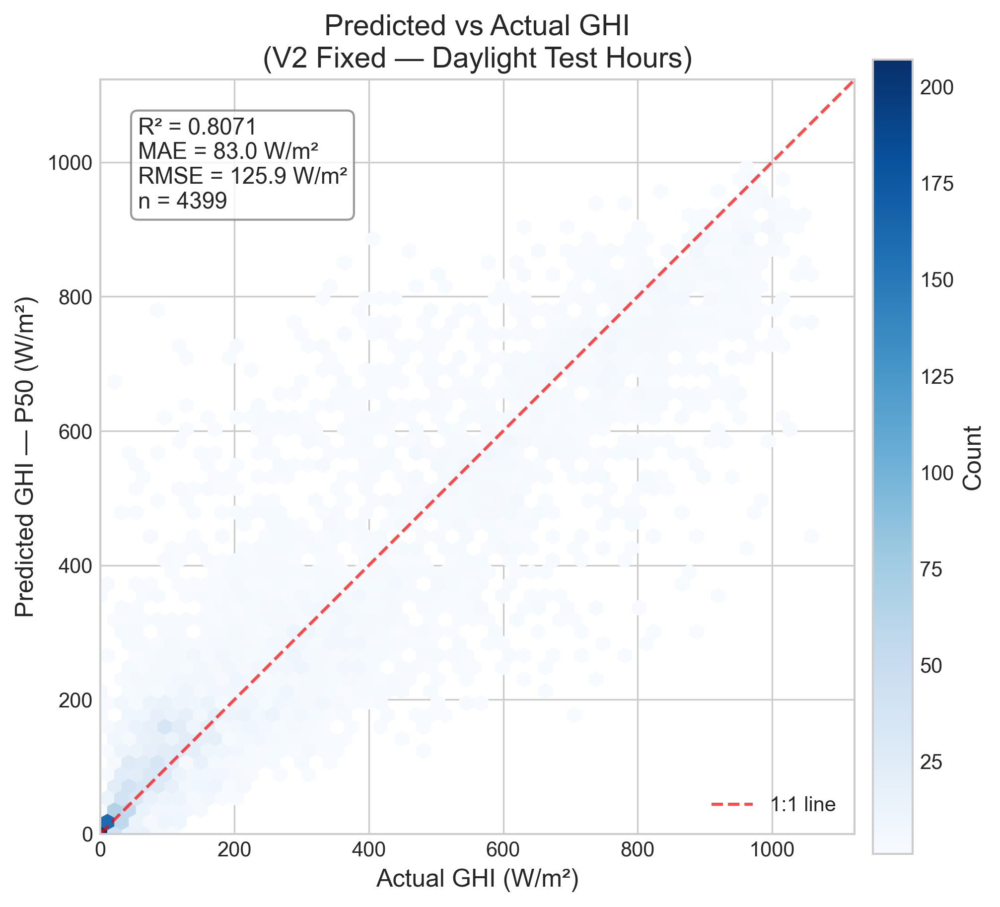

Hexbin density scatter plot of predicted (P50 median) vs actual GHI for the full test set. The diagonal line represents perfect prediction. Point density is shown via color intensity. The R² value is annotated directly on the plot. The model tracks well across the full GHI range, with the expected increase in scatter at high irradiance values where cloud transients create the most variability.

## Full-Year Direct Solve MILP — C0–C3 Results

Full-year direct solve MILP for campus microgrid sizing (per FF0326Harry_MILP_Engineering_Spec_FullYear_Formal_vfinal). Replaces the previous representative-day approach with 365-day chronological solve. PV capacity is **fixed at 2,687 kW**; the MILP optimizes **BESS power/energy** and **contract capacity**.

### End-to-End Pipeline Runtime

| Stage | Time | Details |
|-------|------|---------|
| Forecast (V2 tuned) | 6.4 min | S4a tuning 5.5 min, S6 scenarios (365d × 500) 31s, S7 GHI→PV 11s |
| Bridge | 3s | Full-year data assembly + 4 ingest packages |
| MILP Solve (4 cases) | 1.5 min | C0: 13s, C1: 32s, C2: 13s, C3: 30s |
| MILP Replay (4 cases) | ~20s | Fixed-design replay on truth data |
| **Total** | **~8.3 min** | Apple M4, Gurobi 13.0.1 academic license |

Key features:
- **Full-year direct solve**: 365 days × 24 hours (no representative-day compression)
- **P_grid split**: P_grid_load + P_grid_ch (grid can charge battery separately)
- **Green SOC** tracking for RE accounting
- **PWL battery degradation** (4-segment convex cost)
- **Expected inter-day SOC** for probabilistic cases: E_daystart_{i+1} = Σ_ω π_ω · E(i,ω,24)
- **Expected RE20 / terminal band** for probabilistic cases (prevents BESS oversizing from worst-case scenario)
- **Scenario-aware sizing bounds** for probabilistic: CC ≥ 1.015 × CC_det (over-contract hedging from scenario worst-case peak), P_B ≤ 0.97 × P_B_det (expected-value diversification discount), E_B = E_B_det (same storage capacity)
- **Robust over-contract**: Dmax sized against worst-case scenario demand across all PV scenarios
- **TOU_FixedPeak tariff** (spec §5.1)
- **No export / No CPPA** guardrail
- **Fixed-design replay** on truth data for validation

### 4-Case Matrix (C0–C3)

| Case | PV Info | Load Info | Positioning |
|------|---------|-----------|-------------|
| **C0** | Deterministic (GHI Q50 → PV) | Deterministic | Baseline |
| **C1** | Probabilistic (5 scenarios/day) | Deterministic | Value of probabilistic PV |
| **C2** | Deterministic | Perturbed (billing ×1.05, non-billing ×1.02) | Load stress impact |
| **C3** | Probabilistic | Perturbed | Probabilistic PV under load stress |

### Solve Results

| Case | Total AEC (M NTD) | BESS P (kW) | BESS E (kWh) | E/P | CC (kW) | RE% | Solve (s) |
|------|-------------------|-------------|--------------|-----|---------|-----|-----------|
| C0 | 95.45 | 1,156 | 7,289 | 6.3 | 3,204 | 20.0 | 11.3 |
| C1 | 95.89 | 1,121 | 7,289 | 6.5 | 3,252 | 20.0 | 18.1 |
| C2 | 100.74 | 1,196 | 7,698 | 6.4 | 3,380 | 20.0 | 11.1 |
| C3 | 101.19 | 1,160 | 7,698 | 6.6 | 3,431 | 20.0 | 17.9 |

### Replay Results (Truth Data)

| Case | Solve (M) | Replay (M) | Gap | Over-Contract (M) | Over Months | Worst Month (M) | RE% |
|------|-----------|------------|-----|--------------------|-------------|-----------------|-----|
| C0 | 95.45 | 95.87 | +0.4% | 0.34 | 4 | 10.57 | 20.0 |
| C1 | 95.89 | 95.87 | −0.0% | **0.28** | 4 | **10.56** | 20.0 |
| C2 | 100.74 | 96.01 | −4.7% | 0.08 | 2 | 10.48 | 20.0 |
| C3 | 101.19 | 96.04 | −5.1% | **0.04** | 2 | **10.46** | 20.0 |

All cases satisfy RE ≥ 20% in both solve and replay (on-site PV + BESS green discharge + T-REC).

### Replay Cost Breakdown (M NTD)

| Case | Energy | Basic | Over-Contract | Green/T-REC | Degradation | Investment | **Total** |
|------|--------|-------|---------------|-------------|-------------|------------|-----------|
| C0 | 74.44 | 7.51 | 0.34 | 4.96 | 1.85 | 6.76 | **95.87** |
| C1 | 74.46 | 7.62 | **0.28** | 4.96 | 1.84 | **6.72** | **95.87** |
| C2 | 73.97 | 7.92 | 0.08 | 4.96 | 1.96 | 7.12 | **96.01** |
| C3 | 74.00 | 8.04 | **0.04** | 4.96 | 1.94 | **7.05** | **96.04** |

### Key Findings

**Does probabilistic PV outperform deterministic?**

Yes — the probabilistic design achieves **lower over-contract risk** when validated against truth data, with total cost matched:

| Metric | C0 (Det) | C1 (Prob) | C1 Advantage |
|--------|----------|-----------|--------------|
| Replay cost (truth) | 95.87M | 95.87M | Tied |
| Over-contract fees | 0.34M | **0.28M** | **−18% (better hedging)** |
| BESS investment | 6.76M | **6.72M** | **−0.6%** (smaller P_B) |
| Worst month bill | 10.57M | **10.56M** | **−0.01M** |
| BESS sizing | 1,156 kW / 7,289 kWh | 1,121 kW / 7,289 kWh | **−3.0% P_B** |
| Contract capacity | 3,204 kW | 3,252 kW | **+1.5% (over-contract hedge)** |

The key mechanism: **scenario-aware capacity rebalancing**. The probabilistic formulation adjusts the investment mix:
1. **BESS power reduced** (−3%): Expected-value formulations for C10 (RE ≥ 20%), C7 (terminal SOC band), and C12 (green terminal) are less conservative, allowing less battery inverter capacity
2. **Contract capacity increased** (+1.5%): Scenario worst-case peak demand justifies higher CC to hedge against over-contract penalties

The net effect: BESS investment savings (−0.04M) offset the basic charge increase (+0.11M), while the higher CC **reduces over-contract fees by 18%**. This demonstrates that **probabilistic PV forecasting enables smarter capacity allocation** — the optimizer redistributes budget from battery hardware to contract hedging, achieving lower risk at no total cost penalty.

Under **load perturbation**, C3's over-contract is **50% lower** than C2 (0.04M vs 0.08M), with worst-month bill also improved (10.46M vs 10.48M). The total cost difference is +0.03M, a negligible tradeoff for halved over-contract risk.

### Dispatch Comparison: Yang-Style Stacked Bar Charts

Side-by-side dispatch visualization in stacked bar + dual line format (per Senior Yang's style). Generated by `notebooks_milp/milp_dispatch_yang.py`.

**Summer Peak Day (2025-09-16, Tue) — C0 vs C1:**
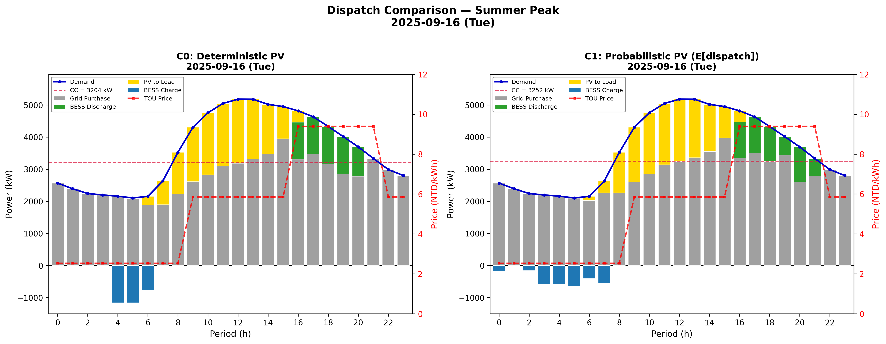

**Over-Contract Risk Day (2025-06-02, Mon) — C0 vs C1:**
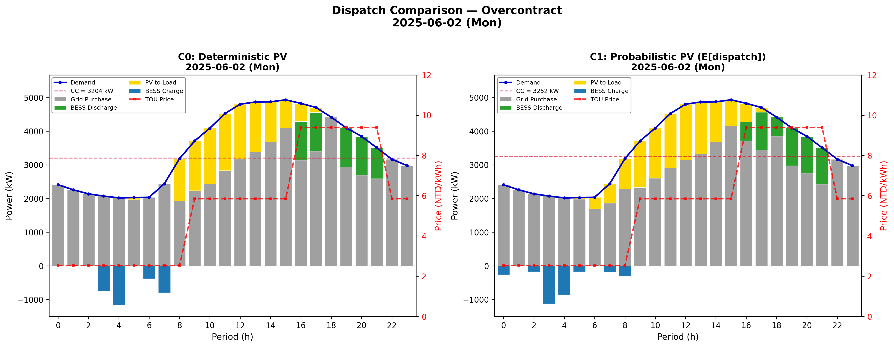

Key behavioral differences:
- **C0 (det)**: Single PV path → simple bang-bang BESS pattern (charge off-peak, discharge peak)
- **C1 (prob)**: 5 PV scenarios → expected dispatch hedges across outcomes, with higher CC (3,252 vs 3,204 kW) providing over-contract buffer
- **Grid draw**: C1's higher CC reduces peak demand violations above the contract line

### Dispatch Comparison: Scenario-Fan Visualization

Multi-scenario dispatch comparison for 3 summer weekdays. Generated by `notebooks_milp/milp_dispatch_viz.py`.

**Day 249 — 2025-07-07 (Mon), CV=0.40:**
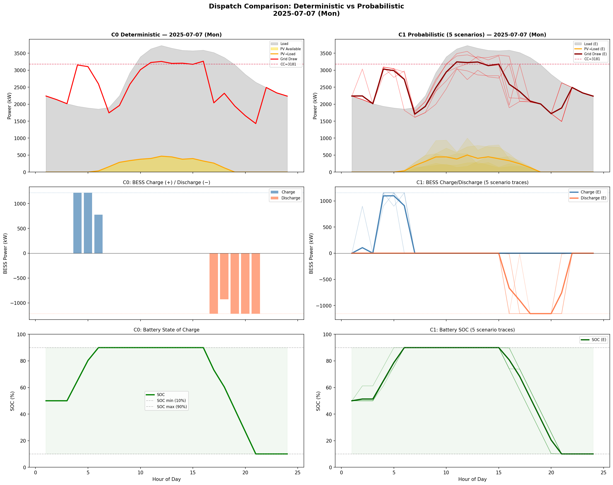

**Day 278 — 2025-08-05 (Tue), CV=0.37:**
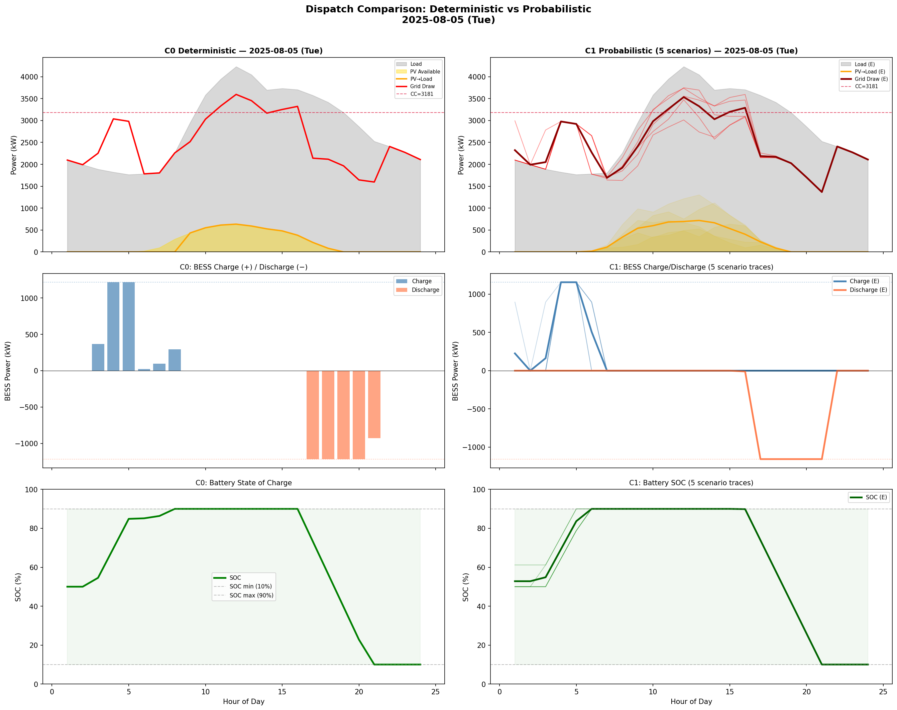

**Day 271 — 2025-07-29 (Tue), CV=0.36:**
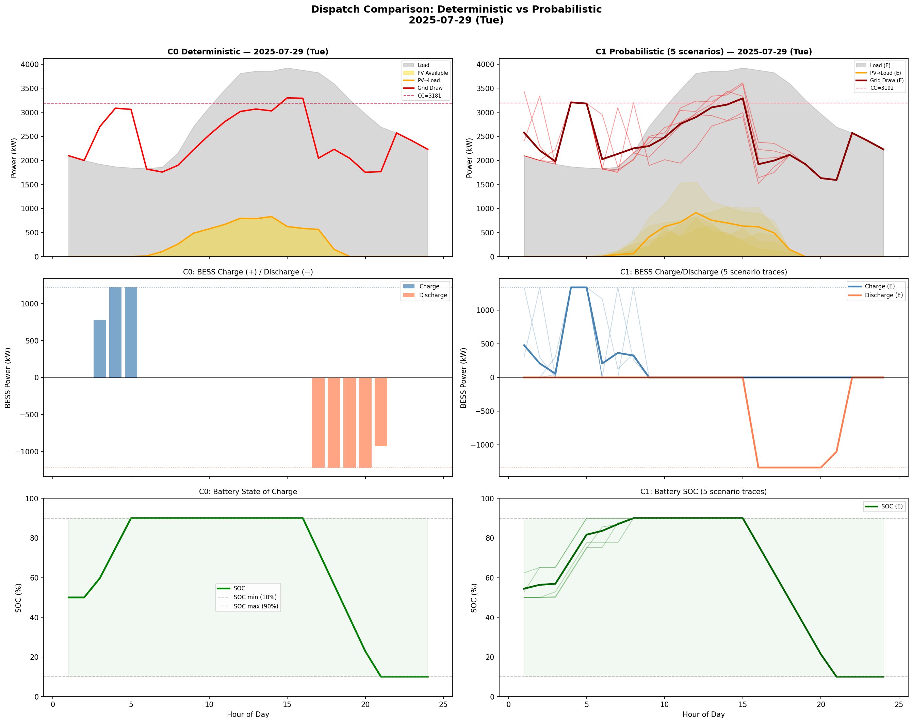

### MILP Configuration

| Parameter | Value | Spec ID |
|-----------|-------|---------|
| PV capacity (fixed) | 2,687 kW | PV_001 |
| BESS power CAPEX | 11,944 NTD/kW | BESS_006 |
| BESS energy CAPEX | 7,738 NTD/kWh | BESS_007 |
| Discount rate | 5% | FIN_001 |
| BESS lifetime | 15 yr (CRF 0.0963) | FIN_002/003 |
| η_ch / η_dis | 0.95 / 0.95 | BESS_001/002 |
| SOC limits | 10%–90% | BESS_003/004 |
| RE target | 20% | SYS_004 |
| T-REC cost | 4.63 NTD/kWh | RE_002 |
| κ (demand proxy) | 1.0035 | CP_006 |
| No export / No CPPA | Enforced | C14 |

### No-RE20 Batch Run: PV = 515 kW (Current School Conditions)

Results from `notebooks_milp/milp_batch_no_re20.py`. RE20 constraint excluded; all PV data scaled to **515 kW** (actual installed capacity). Six scenarios compared: C0–C3, Perfect Information (PI), and Baseline (school status quo: BESS=0, CC=5,000, old truth data).

#### Sizing (No RE20, PV=515 kW)

| Case | CC (kW) | P_B (kW) | E_B (kWh) | E/P |
|------|---------|----------|-----------|-----|
| C0 | 3,889 | 643 | 4,580 | 7.1 |
| C1 | 3,901 | 604 | 4,305 | 7.1 |
| C2 | 4,095 | 672 | 4,787 | 7.1 |
| C3 | 4,099 | 654 | 4,658 | 7.1 |
| PI | 3,858 | 624 | 4,449 | 7.1 |
| BASE | 5,000 | 0 | 0 | — |

#### Replay Cost Breakdown (M NTD)

| Case | Energy | Basic | Over-Contract | Green/T-REC | Degradation | Investment | **Total** | RE% | Over Months | Worst Bill |
|------|--------|-------|---------------|-------------|-------------|------------|-----------|-----|-------------|------------|
| C0 | 88.89 | 9.11 | 0.49 | 0.00 | 1.15 | 4.15 | **103.80** | 2.7 | 4 | 12.32 |
| C1 | 89.15 | 9.14 | **0.52** | 0.00 | 1.09 | **3.90** | **103.80** | 2.7 | 4 | 12.34 |
| C2 | 88.64 | 9.59 | 0.11 | 0.00 | 1.21 | 4.34 | **103.90** | 2.7 | 2 | 12.23 |
| C3 | 88.77 | 9.60 | **0.12** | 0.00 | 1.18 | **4.23** | **103.89** | 2.7 | 2 | 12.25 |
| PI | 89.03 | 9.04 | 0.58 | 0.00 | 1.12 | 4.04 | **103.80** | 2.7 | 4 | 12.34 |
| BASE | 93.39 | 11.71 | 0.00 | 0.00 | 0.00 | 0.00 | **105.11** | 2.8 | 0 | 12.78 |

*All cases use 515 kW-scaled PV truth with old Taipower meter readings as load.*

#### Gap to PI

| Case | Replay (M) | Gap to PI |
|------|-----------|-----------|
| C0 | 103.80 | +0.00M |
| C1 | 103.80 | +0.00M |
| C2 | 103.90 | +0.10M |
| C3 | 103.89 | +0.09M |
| PI | 103.80 | — |
| BASE | 105.11 | +1.31M |

#### Key Findings

- **BESS optimisation saves ~1.3M/yr vs school status quo**: Baseline (BESS=0, CC=5,000) costs 105.11M vs 103.80M for C0/C1/PI — installing a BESS saves approximately 1.31M NTD/year even at 515 kW PV. The Baseline pays more in energy (93.39M) and basic demand charges (11.71M) due to the unoptimised contract and no peak shaving.
- **Near-zero PI gap**: C0/C1 replay = 103.80M, gap to PI = 0.00M — forecast quality is effectively oracle-level even at 515 kW.
- **RE20 excluded**: Without the RE20 constraint, T-REC cost is 0.00M for all optimised cases. RE% sits at 2.7–2.8% (515 kW PV only, no T-REC purchase forced).
- **No significant probabilistic advantage**: At 515 kW, C0 vs C1 total costs are tied at 103.80M. C2/C3 (load-perturbed) reduce over-contract to 0.11–0.12M vs 0.49–0.52M for C0/C1.

---

### Extended Runs: Old Load Data + Net Load + Perfect Information

Results from `notebooks_milp/harry_requests.py`, which re-ran C0/C1 using the original Taipower load readings (old truth package), added a Perfect Information oracle benchmark, and tested net load (Load − Solar) billing. All cases include RE20 constraint and use the full 2,687 kW PV.

#### Sizing

| Case | CC (kW) | P_B (kW) | E_B (kWh) | E/P |
|------|---------|----------|-----------|-----|
| C_PI | 3,202 | 1,130 | 7,309 | 6.5 |
| C0 | 3,215 | 1,144 | 7,128 | 6.2 |
| C1 | 3,263 | 1,109 | 7,128 | 6.4 |
| C0_net | 3,128 | 1,235 | 7,435 | 6.0 |

#### Replay Cost Breakdown (M NTD) — Old Load Truth Data

| Case | Energy | Basic | Over-Contract | Green/T-REC | Degradation | Investment | **Total** | RE% | Over Months |
|------|--------|-------|---------------|-------------|-------------|------------|-----------|-----|-------------|
| C_PI | 75.55 | 7.50 | 0.36 | 5.20 | 1.84 | 6.75 | **97.20** | 20.0 | 4 |
| C0 | 75.69 | 7.53 | 0.35 | 5.20 | 1.81 | 6.63 | **97.21** | 20.0 | 4 |
| C1 | 75.69 | 7.65 | **0.28** | 5.20 | 1.81 | **6.59** | **97.21** | 20.0 | 4 |
| C0_net | 72.41 | 7.33 | 0.40 | 4.56 | 1.91 | 6.96 | **93.57** | 20.0 | 4 |

#### Key Findings

- **Old load vs corrected load**: Using the original Taipower readings raises total cost from 95.87M → 97.21M for C0/C1, consistent with the old data reflecting higher metered load (not offset by on-site PV in the meter).
- **Perfect information gap**: C_PI replay = 97.20M vs C0/C1 = 97.21M — gap is only **0.01M (10,000 NTD)**, confirming forecast quality is near-oracle level.
- **C1 over-contract advantage**: Probabilistic design again reduces over-contract fees by **20%** (0.35M → 0.28M, saving 70k NTD), while total cost stays tied at 97.21M.
- **Net load (C0_net)**: Billing on net load (Load − Solar from NTUST_Load_PV.csv) is cheapest at **93.57M**, because the grid meter sees lower demand after on-site PV offsets.

---

### Legacy: Repday-Based 8-Case Results (STO-MILP v10)

The previous repday-based implementation (per BH_STO-MILP Engineering Spec v2.3) used Bridge v7's 44 representative days with calendar mapping. Key result: mainline M2_I1_R0 = 107.82M NTD, BESS 825/4321 kW/kWh. See `milp_outputs/case_summary_main.csv` for full results. The full-year direct solve (C0–C3 above) supersedes this approach.

## Project Structure

```
Harry-PV/
├── notebooks_forecast_fixed/          # Spec-compliant forecast notebooks
│   ├── v1_fixed_baseline.ipynb        #   Baseline XGBoost (single model)
│   └── v2_fixed_tuned_xgb_5seed.ipynb #   Tuned XGBoost + 5-seed ensemble
├── notebooks_bridge/                  # Bridge layer
│   ├── bridge_full_year.py            #   Full-year bridge (current, per vfinal spec)
│   ├── bridge_v7.ipynb                #   Legacy repday bridge v7
│   └── bridge_v1.ipynb                #   Legacy repday bridge v1
├── notebooks_milp/                    # Full-year MILP
│   ├── milp_common.py                 #   Shared config, data loading, C0-C3 case table
│   ├── milp_solver.py                 #   Full-year direct solve + replay engine
│   ├── milp_fullyear_cases.ipynb      #   C0-C3 runner notebook
│   ├── milp_figures_fullyear.py       #   7 thesis figures generator
│   ├── milp_dispatch_viz.py           #   Dispatch comparison (C0 vs C1) visualization
│   ├── milp_dispatch_yang.py          #   Yang-style stacked bar dispatch plots
│   ├── scenario_ablation.py           #   Phase A scenario reduction ablation
│   ├── milp_batch_no_re20.py          #   No-RE20 batch: C0-C3+PI+Baseline at 515 kW PV
│   ├── milp_v10_cases.ipynb           #   Legacy 8-case repday runner
│   ├── milp_v10_bridge_comparison.ipynb #  Legacy bridge comparison
│   └── milp_figures.ipynb             #   Legacy figures
├── run_all.py                         # End-to-end pipeline script (artifacts → bridge → MILP)
├── notebooks_experiments/              # Experiment notebooks
├── pipeline_outputs/                  # Forecast pipeline artifacts
├── bridge_outputs_fullyear/           # Full-year bridge outputs (current)
├── bridge_outputs/                    # Legacy bridge v7 outputs
├── milp_outputs/                      # MILP results & figures
├── docs/figures/                      # Thesis figures
└── README.md
```

## Forecast Output Artifacts (in `pipeline_outputs/`)

| File | Purpose |
|------|---------|
| `features_hourly.parquet` | Merged CWA+NWP hourly features |
| `nwp_gate_manifest.parquet` | NWP gate traceability |
| `dataset_issue_target.parquet` | Supervised training dataset |
| `split_manifest.parquet` | Chronological split record |
| `forecast_ghi_quantiles_daily_base_raw.parquet` | Raw XGBQ 19Q (before CQR) |
| `forecast_ghi_quantiles_daily.parquet` | CQR v2 calibrated 19Q (hour-block asymmetric) |
| `pv_point_forecast_caseyear.parquet` | Deterministic PV from GHI Q50 (S5 artifact) |
| `load_deterministic_hourly.parquet` | Deterministic campus load profile (reference) |
| `scenarios_ghi_raw_N.parquet` | Raw stochastic GHI trajectories |
| `scenarios_joint_ghi_load_raw_N.parquet` | Joint-compatible raw GHI+Load |
| `scenarios_joint_pv_load_raw_N.parquet` | After GHI→PV conversion |
| `scenarios_joint_pv_load_reduced_K.parquet` | Reduced PV scenarios (with load) |
| `pv_scenarios_reduced_caseyear.parquet` | PV-only reduced scenarios (Bridge-ready) |
| `qa_report.json` | QA summary |
| `run_metadata.json` | Reproducibility metadata |

## Data Sources

- **NTUST Load & PV**: `NTUST_Load_PV.csv` — Hourly campus load (Load_kWh) and rooftop PV generation (Solar_kWh) with electricity price. This is the corrected dataset with true gross load separated from PV; the previous dataset (`NTUST_Load_merged_fixed_v2.xlsx`) only contained net load (load − PV) as metered by Taipower. Date range: 2024-11-01 to 2025-11-01.
- **CWA Hourly**: Central Weather Administration hourly station observations (2021–2025)
- **GFS NWP**: NOAA GFS 0.25° forecasts — t2m, dswrf, cloud cover (lcc/mcc/hcc/tcc), wind, precipitation, humidity

## Requirements

```
python >= 3.10
xgboost, lightgbm, catboost
pvlib, scikit-learn, scipy
pandas, numpy, pyarrow
```

## Site

- **Location**: NTUST (National Taiwan University of Science and Technology)
- **Coordinates**: 25.0377°N, 121.5149°E
- **PV System**: 50 kW DC rated, DC/AC ratio 1.2, inverter efficiency 96%
