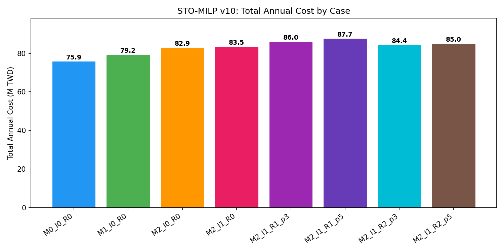
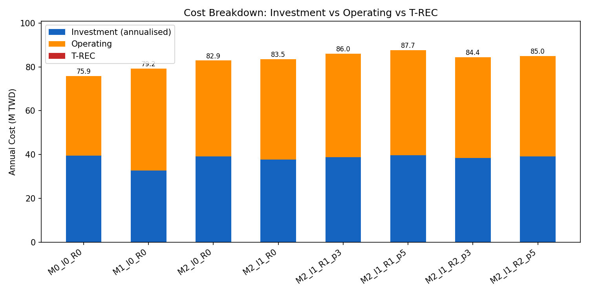
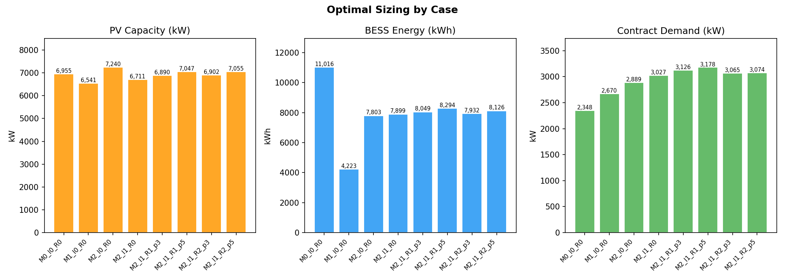
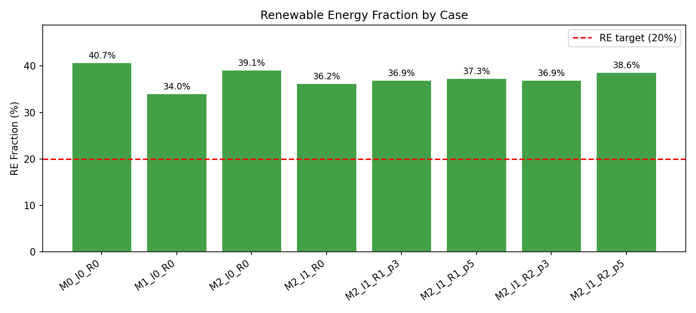
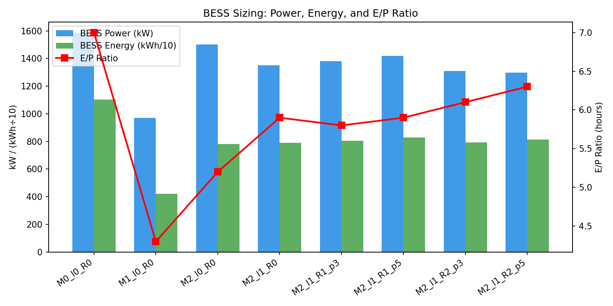
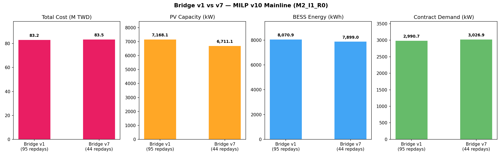
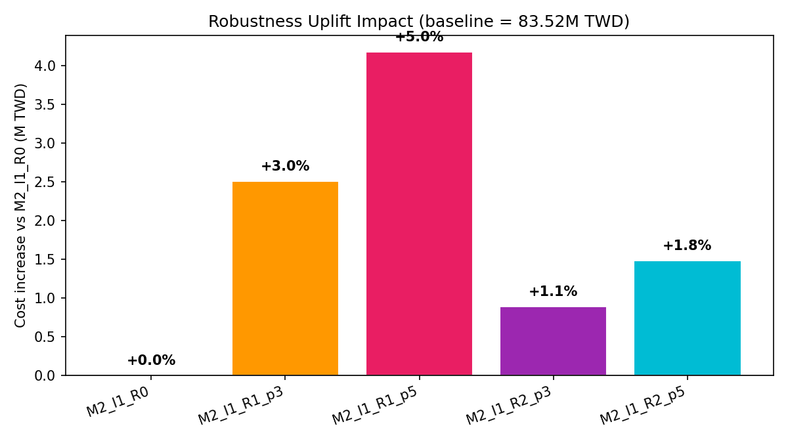
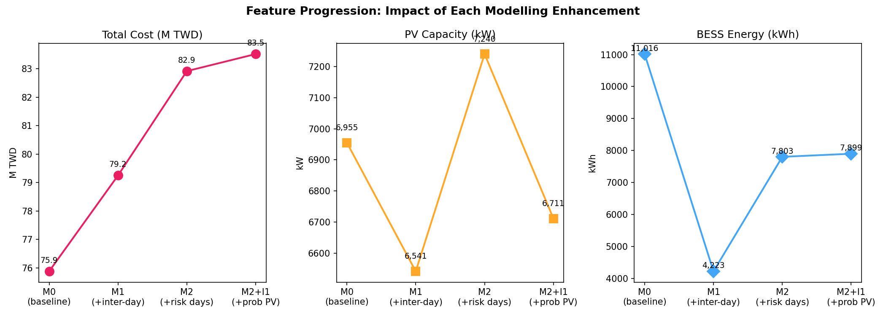

# Harry-PV: Day-Ahead Solar Irradiance Probabilistic Forecasting & Bridge Layer

Day-ahead GHI (Global Horizontal Irradiance) probabilistic forecasting pipeline for the NTUST site in Taipei, Taiwan. Uses CQR-XGBQ (Conformal Quantile Regression with XGBoost Quantile) to produce 19 calibrated quantile forecasts (P05–P95), converts to PV power, generates reduced scenarios, then transforms them via a bridge layer into representative-day tables for the annual sizing MILP.

## Pipeline Overview

```
Forecast Layer:
  CWA Hourly Obs + GFS NWP → Feature Engineering → 19-Quantile Models → CQR Calibration
  → GHI Scenario Generation → GHI→PV Conversion → k-Medoids Reduction → Bridge-Ready Package

Bridge Layer:
  Daily PV Packages → Day Descriptors → Risk-Day Tagging → Body-Day Clustering
  → Medoid Selection → Calendar Map + Weights → Repday Scenario Tables → Annual MILP Ingest
```

- **Gate-compliant**: All NWP data respects D-1 12:00 UTC deadline (no future data leakage)
- **Strict anti-leakage**: No contemporaneous CWA observations used as features — only lagged (>=24h) observations
- **Split-conformal CQR**: Calibrated prediction intervals with finite-sample correction
- **GHI-only stochastic**: Load is deterministic; only GHI/PV drives scenario uncertainty
- **PV-only reduction**: k-medoids clusters on PV trajectories (24-dim), not PV+Load

## Forecast Results

### Original Notebooks (Test Set — Last 365 Days, Daytime)

| Version | Description | MAE (W/m²) | R² | Notes |
|---------|-------------|------------|------|-------|
| V1 | Baseline XGBoost, default params | 83.93 | 0.8049 | Single model, lr=0.05, depth=8 |
| V2 | Tuned XGBoost + 5-seed ensemble | 83.01 | 0.8071 | 162-combo grid search |
| V3 | Tuned XGBoost + 10-seed ensemble | 83.01 | 0.8071 | 720-combo fine grid |
| V4 | LightGBM 10-seed ensemble | ~82.09 | ~0.81 | |
| V5 | CatBoost 10-seed ensemble | ~82.32 | ~0.81 | |
| V6 | 3-Model Ensemble (XGB+LGB+CB) | 83.00 | 0.8062 | Equal-weight average |

### Spec-Compliant Fixed Notebooks (Test Set — Last 365 Days)

Per Forecast Engineering Spec Final v2 (2024-03-24). Load data sourced from `NTUST_Load_PV.csv` (true gross load, not net load).

| Version | Description | MAE All (W/m²) | MAE Daytime (W/m²) | R² All | R² Daytime | CRPS |
|---------|-------------|----------------|---------------------|--------|------------|------|
| V1 Fixed | Baseline XGBoost | 42.56 | 80.44 | 0.8759 | 0.8145 | 31.64 |
| V2 Fixed | Tuned XGBoost + 5-seed | 42.10 | 79.60 | 0.8773 | 0.8165 | 31.24 |

The forecast model (S0–S4b) is identical between original and fixed notebooks. Small metric differences are due to XGBoost non-determinism across runs. The fixes only affect downstream stages:

| Stage | Original | Fixed (Spec-Compliant) |
|-------|----------|----------------------|
| S5 | Load 19Q via residual quantiles | Deterministic load profile |
| S6 | Gaussian Copula joint GHI+Load | GHI-only scenarios + deterministic load appended |
| S8 | k-medoids on PV+Load (48-dim) | k-medoids on PV only (24-dim) |

### Comparison with Harry's Original Pipeline

| Metric | Harry's Pipeline | Our Pipeline |
|--------|------------------|-------------|
| MAE | 75.14 W/m² | ~80 W/m² |
| R² | 0.8618 | ~0.81 |
| Data Leakage | Yes (contemporaneous obs) | No (strict gate compliance) |
| Postprocessing | Bucket shift+scale + afternoon fix | CQR calibration only |

Harry's lower MAE is explained by his model using contemporaneous CWA weather observations as features — data leakage that would not be available at forecast time in a real day-ahead setting.

## NWP Contribution Analysis

Ablation experiment comparing forecast performance with and without the 14 GFS-derived NWP features. See `notebooks_experiments/nwp_contribution.ipynb`.

| Setting | MAE All (W/m²) | MAE Daytime (W/m²) | R² All | R² Daytime | CRPS |
|---------|----------------|---------------------|--------|------------|------|
| V1 With NWP | 42.56 | 84.04 | 0.8759 | 0.8046 | 31.64 |
| V1 Without NWP | 66.86 | 132.31 | 0.7305 | 0.5759 | 47.73 |
| V2 With NWP (5-seed) | 42.10 | 83.16 | 0.8773 | 0.8067 | 31.24 |
| V2 Without NWP (5-seed) | 65.98 | 130.57 | 0.7322 | 0.5785 | 47.07 |

**NWP Impact (V1)**: MAE reduced by 48.27 W/m² (36.5%), R² improved by +0.2287, CRPS reduced by 33.7%

**NWP Impact (V2)**: MAE reduced by 47.40 W/m² (36.3%), R² improved by +0.2282, CRPS reduced by 33.6%

NWP is critical — without GFS forecast data, the model cannot predict next-day cloud cover, which is the dominant source of GHI variability in Taipei's subtropical climate.

## Comparison with Pieter's RNN-LSTM (Per-Season)

Re-evaluation using Pieter Hernando's methodology (per-season, all hours including nighttime). See `notebooks_experiments/pieter_comparison.ipynb`.

| Season | MAE Ours (W/m²) | MAE Pieter (W/m²) | Improvement | RMSE Ours | RMSE Pieter | Improvement |
|--------|-----------------|-------------------|-------------|-----------|-------------|-------------|
| Summer | 54.71 | 105.13 | -48.0% | 108.00 | 154.65 | -30.2% |
| Fall | 30.68 | 93.57 | -67.2% | 69.59 | 136.06 | -48.9% |
| Winter | 32.39 | 99.81 | -67.5% | 72.62 | 142.04 | -48.9% |
| Spring | 47.56 | 118.77 | -60.0% | 95.07 | 158.13 | -39.9% |
| **Avg** | **41.34** | **104.32** | **-60.4%** | **86.32** | **147.72** | **-41.6%** |

Caveats: different test years (2024–25 vs 2019), our model uses NWP (GFS) which Pieter's LSTM did not, and Pieter trains per-season while we train one model on all data.

## Bridge Layer Results

### Bridge v7 (Current — per Spec v7, 2025-03-25)

| Metric | Value |
|--------|-------|
| Calendar days | 365 |
| Total repdays | 44 (16 body + 28 risk) |
| Body clusters | 16 (global k-medoids with month×day_type weighted features) |
| Risk scoring | Single Stress_i = PeakLoad − PV_P10_peakWindow (top 5%) |
| Scenarios per repday | 5 (per-repday, inherited from source date) |
| Calendar map coverage | 100% |
| Weight sum | 365 |

### Bridge v1 (Legacy — per Spec v3, for comparison)

| Metric | Value |
|--------|-------|
| Total repdays | 95 (20 body + 75 risk) |
| Body clusters | 20 (stratified by month) |
| Risk scoring | Union of 3 criteria (top 10% stress/peak-load/low-PV) |

### Bridge Output Artifacts (in `bridge_outputs/`)

| File | Purpose |
|------|---------|
| `repdays_metadata.parquet` | Master index of representative days and risk days |
| `calendar_map.parquet` | Maps each calendar day to a repday (for SOC linkage) |
| `scenarios_repdays_pv_reduced.parquet` | Repday-level PV scenarios for MILP |
| `risk_day_tags.parquet` | Risk tags and scores for all dates |
| `risk_day_scores.csv` | Risk day Stress_i scores (v7) |
| `bridge_clustering_summary.csv` | Cluster assignment summary (v7) |
| `bridge_coverage_by_month.csv` | Month-level coverage diagnostics (v7) |
| `bridge_report.json` | Bridge parameters and QA diagnostics |
| `bridge_run_metadata.json` | Reproducibility metadata |

## Forecast Thesis Figures

Publication-quality visualizations generated from `notebooks_experiments/thesis_figures.ipynb`. Both V1 (baseline XGBoost) and V2 (tuned + 5-seed ensemble) results are shown where applicable.

### Fig 1 — Quantile Fan Chart (3 Representative Days)


Shows the 19-quantile probabilistic forecast (P05–P95) as nested prediction bands for three representative days: a clear-sky day, a mixed/partly-cloudy day, and an overcast day. The median forecast (P50) is drawn as a solid line, with progressively lighter shading toward the tails. This demonstrates that the model produces well-calibrated uncertainty — narrow bands on clear days (high confidence) and wide bands on cloudy days (appropriate uncertainty).

### Fig 2 — Reliability Diagram (CQR Calibration Proof)


Plots nominal quantile level (x-axis) vs observed empirical coverage (y-axis) for both raw XGBQ output and post-CQR calibrated output. A perfectly calibrated model falls on the diagonal. The raw model shows systematic under-coverage at the tails; after split-conformal CQR calibration, all 19 quantiles align closely with the diagonal — proving that our prediction intervals have valid finite-sample coverage guarantees.

### Fig 3 — NWP Ablation (Impact of Weather Forecasts)


Grouped bar chart comparing forecast performance with and without the 14 GFS-derived NWP features, across both V1 and V2 model versions. Metrics shown: MAE (daytime), R² (daytime), and CRPS. Removing NWP degrades MAE by ~36% and R² by ~0.23 — confirming that numerical weather prediction data is the single most important input for day-ahead solar forecasting in Taipei's cloud-dominated climate.

### Fig 4 — Per-Season Comparison with Pieter's RNN-LSTM


Side-by-side per-season MAE comparison between our CQR-XGBQ pipeline and Pieter Hernando's dual-layer RNN-LSTM (2023 thesis). Uses Pieter's exact methodology: per-season evaluation, all hours including nighttime. Our model achieves 48–68% lower MAE across all four seasons, with the largest gains in Fall and Winter where NWP cloud-cover forecasts provide the most value.

### Fig 5 — Feature Importance (Top 20)


Top 20 features ranked by XGBoost gain, with NWP-derived features highlighted in blue and non-NWP features in gray. NWP features (especially `dswrf` — downward shortwave radiation flux, and cloud cover variables) dominate the top ranks, visually confirming the ablation study results. The lagged CWA observation features (`ghi_lag24`, `temp_lag24`) also contribute meaningfully as persistence baselines.

### Fig 6 — Error Heatmap (Hour × Month)


MAE heatmap with hour-of-day on the y-axis and month on the x-axis (daylight hours only). Reveals the spatiotemporal error structure: highest errors occur during midday hours in summer months (Jun–Aug) when convective cloud development is most unpredictable. Winter and shoulder-season mornings/evenings show the lowest errors. This pattern is consistent with Taipei's subtropical monsoon climate.

### Fig 7 — Scatter: Predicted vs Actual GHI


Hexbin density scatter plot of predicted (P50 median) vs actual GHI for the full test set. The diagonal line represents perfect prediction. Point density is shown via color intensity. The R² value is annotated directly on the plot. The model tracks well across the full GHI range, with the expected increase in scatter at high irradiance values where cloud transients create the most variability.

## STO-MILP v10 — Optimization Results

Two-stage stochastic MILP for optimal campus microgrid sizing (per STO-MILP Engineering Spec v10). Gurobi solver with inter-day SOC linkage (Method 1), Green SOC tracking for RE accounting, segmented demand billing with κ proxy, and T-REC top-up.

### 8-Case Experimental Matrix

| Case | Total Cost (M TWD) | PV (kW) | BESS E (kWh) | BESS P (kW) | Contract (kW) | RE% |
|------|-------------------|---------|---------------|-------------|---------------|-----|
| M0_I0_R0 (baseline) | 75.88 | 6,955 | 11,016 | 1,585 | 2,348 | 40.7 |
| M1_I0_R0 (+inter-day) | 79.25 | 6,541 | 4,223 | 971 | 2,670 | 34.0 |
| M2_I0_R0 (+risk days) | 82.92 | 7,241 | 7,803 | 1,501 | 2,889 | 39.1 |
| **M2_I1_R0 (mainline)** | **83.52** | **6,711** | **7,899** | **1,350** | **3,027** | **36.2** |
| M2_I1_R1_p3 (+3% all-day) | 86.03 | 6,890 | 8,049 | 1,381 | 3,126 | 36.9 |
| M2_I1_R1_p5 (+5% all-day) | 87.70 | 7,047 | 8,294 | 1,418 | 3,178 | 37.3 |
| M2_I1_R2_p3 (+3% peak) | 84.41 | 6,902 | 7,932 | 1,308 | 3,065 | 36.9 |
| M2_I1_R2_p5 (+5% peak) | 85.00 | 7,055 | 8,126 | 1,298 | 3,074 | 38.6 |

### Bridge v1 vs v7 Comparison (Mainline M2_I1_R0)

| Bridge | Total Cost (M TWD) | PV (kW) | BESS E (kWh) | Contract (kW) | RE% | Solve Time |
|--------|-------------------|---------|---------------|---------------|-----|-----------|
| v1 (95 repdays) | 83.23 | 7,168 | 8,071 | 2,991 | 39.0 | 33.7s |
| v7 (44 repdays) | 83.52 | 6,711 | 7,899 | 3,027 | 36.2 | 25.5s |

Cost difference: +0.3% (v7 vs v1). Bridge v7 solves 1.3x faster with 54% fewer repdays while producing near-identical optimal sizing.

### MILP v10 Figures

Visualizations generated from `notebooks_milp/milp_figures.ipynb`:

















### MILP v10 Configuration

| Parameter | Value |
|-----------|-------|
| PV CAPEX | 40,000 TWD/kW |
| BESS power CAPEX | 11,944 TWD/kW |
| BESS energy CAPEX | 7,738 TWD/kWh |
| BESS FOM | 1% of energy CAPEX |
| Discount rate | 5% |
| PV lifetime | 20 yr (CRF 0.0802) |
| BESS lifetime | 15 yr (CRF 0.0963) |
| Charge/discharge efficiency | 95% / 95% |
| SOC limits | 10%–90% |
| RE target | 20% |
| T-REC cost | 4.63 TWD/kWh |
| κ (demand proxy) | 1.0035 |
| No export | PV routes to load or BESS only |

## Project Structure

```
Harry-PV/
├── notebooks_forecast_fixed/          # Spec-compliant forecast notebooks
│   ├── v1_fixed_baseline.ipynb        #   Baseline XGBoost (single model)
│   └── v2_fixed_tuned_xgb_5seed.ipynb #   Tuned XGBoost + 5-seed ensemble
├── notebooks_bridge/                  # Bridge layer notebooks
│   ├── bridge_v7.ipynb                #   Bridge v7 (current, per Spec v7)
│   └── bridge_v1.ipynb                #   Bridge v1 (legacy, per Spec v3)
├── notebooks_milp/                    # STO-MILP v10 notebooks
│   ├── milp_common.py                 #   Shared config, data loading, case table
│   ├── milp_v10_cases.ipynb           #   8-case experimental matrix runner
│   ├── milp_v10_bridge_comparison.ipynb #  Bridge v1 vs v7 comparison
│   └── milp_figures.ipynb             #   Results figures (Fig 1–8)
├── notebooks_experiments/              # Experiment notebooks
│   ├── nwp_contribution.ipynb         #   NWP ablation study
│   ├── pieter_comparison.ipynb        #   Comparison with Pieter's RNN-LSTM
│   └── thesis_figures.ipynb           #   Forecast thesis figures
├── notebooks/                         # Original iteration notebooks (archived)
├── pipeline_outputs/                  # Forecast pipeline artifacts (gitignored)
├── bridge_outputs/                    # Bridge v7 outputs (gitignored)
├── bridge_outputs_v1/                 # Bridge v1 outputs (gitignored)
├── milp_outputs/                      # MILP v10 results & figures (gitignored)
├── docs/figures/                      # Thesis figures (PNG, tracked in git)
├── Project_Archive_Prediction_Final/  # Harry's original code & data (reference)
└── README.md
```

## Forecast Output Artifacts (in `pipeline_outputs/`)

| File | Purpose |
|------|---------|
| `features_hourly.parquet` | Merged CWA+NWP hourly features |
| `nwp_gate_manifest.parquet` | NWP gate traceability |
| `dataset_issue_target.parquet` | Supervised training dataset |
| `split_manifest.parquet` | Chronological split record |
| `forecast_ghi_quantiles_daily_base_raw.parquet` | Raw XGBQ 19Q (before CQR) |
| `forecast_ghi_quantiles_daily.parquet` | Official CQR-calibrated 19Q |
| `load_deterministic_hourly.parquet` | Deterministic campus load profile |
| `scenarios_ghi_raw_N.parquet` | Raw stochastic GHI trajectories |
| `scenarios_joint_ghi_load_raw_N.parquet` | Joint-compatible raw GHI+Load |
| `scenarios_joint_pv_load_raw_N.parquet` | After GHI→PV conversion |
| `scenarios_joint_pv_load_reduced_K.parquet` | Bridge-ready reduced PV scenarios |
| `qa_report.json` | QA summary |
| `run_metadata.json` | Reproducibility metadata |

## Data Sources

- **NTUST Load & PV**: `NTUST_Load_PV.csv` — Hourly campus load (Load_kWh) and rooftop PV generation (Solar_kWh) with electricity price. This is the corrected dataset with true gross load separated from PV; the previous dataset (`NTUST_Load_merged_fixed_v2.xlsx`) only contained net load (load − PV) as metered by Taipower. Date range: 2024-11-01 to 2025-11-01.
- **CWA Hourly**: Central Weather Administration hourly station observations (2021–2025)
- **GFS NWP**: NOAA GFS 0.25° forecasts — t2m, dswrf, cloud cover (lcc/mcc/hcc/tcc), wind, precipitation, humidity

## Requirements

```
python >= 3.10
xgboost, lightgbm, catboost
pvlib, scikit-learn, scipy
pandas, numpy, pyarrow
```

## Site

- **Location**: NTUST (National Taiwan University of Science and Technology)
- **Coordinates**: 25.0377°N, 121.5149°E
- **PV System**: 50 kW DC rated, DC/AC ratio 1.2, inverter efficiency 96%
