# Harry-PV: Probabilistic PV Forecasting & CC/BESS Annual Sizing Pipeline

**Thesis**: *Quantifying the Decision Value of Probabilistic PV Information for Annual Fixed Design of Contract Capacity and BESS under RE20* — 黃博鴻 (Harry), NTUST

This repository implements the complete end-to-end pipeline from day-ahead GHI probabilistic forecasting through the two-layer MILP annual sizing of Contract Capacity (CC) and Battery Energy Storage System (BESS) for the NTUST campus microgrid. The pipeline quantifies the monetary value of upgrading from deterministic to probabilistic PV forecasts across five formal cases (C0–C3, C_PFI).

---

## Architecture

```
┌─────────────────────────────────────────────────────────────────────┐
│  FORECAST LAYER  (Project_Archive_Prediction_Final/)                │
│                                                                     │
│  generate_pipeline_inputs.py  ─→  synthetic GHI quantiles + load   │
│  9_calibration_comparison.py  ─→  CQR method comparison + figures  │
│  10_cqr_improved.py           ─→  hour-block asymmetric CQR        │
│  11_regenerate_scenarios.py   ─→  Gaussian copula + k-medoids      │
└───────────────────────────────┬─────────────────────────────────────┘
                                │
                    pipeline_outputs/
                    ├── forecast_ghi_quantiles_daily.parquet
                    ├── scenarios_joint_pv_load_reduced_5.parquet
                    ├── pv_point_forecast_caseyear.parquet
                    └── load_deterministic_hourly.parquet
                                │
┌───────────────────────────────▼─────────────────────────────────────┐
│  BRIDGE LAYER  (notebooks_bridge/)                                  │
│                                                                     │
│  bridge_full_year.py   ─→  5 rolling DA packages (C0–C3 + C_PFI)  │
│  repday_builder.py     ─→  81 rep-days (51 risk + 30 body)         │
│  scenario_reduction.py ─→  case-dependent PV/load reduction        │
└───────────────────────────────┬─────────────────────────────────────┘
                                │
                    bridge_outputs_fullyear/
                    ├── rolling_da_input_pvXXX_loadXXX.parquet  (×5)
                    ├── repday_input_pvXXX_loadXXX.parquet      (×5)
                    ├── caseyear_calendar_manifest.parquet
                    └── full_year_replay_truth_package.parquet
                                │
┌───────────────────────────────▼─────────────────────────────────────┐
│  MILP LAYER  (notebooks_milp/)                                      │
│                                                                     │
│  milp_layer_a.py   ─→  Layer A: rep-day annual design selection     │
│  milp_layer_b.py   ─→  Layer B: daily rolling solve + replay        │
│  milp_common.py    ─→  config, tariffs, shared parameters          │
└───────────────────────────────┬─────────────────────────────────────┘
                                │
                    milp_outputs/
                    ├── design_results_C0.json (CC*, P_B*, E_B*)
                    ├── replay_summary_C0.json
                    └── design_results_master.csv  (all 5 cases)
```

---

## Environment Setup

### Python Environment

```bash
# Create virtual environment (Python 3.12)
python3 -m venv .venv
source .venv/bin/activate

# Install dependencies
pip install pandas numpy scipy pvlib scikit-learn tqdm matplotlib pyarrow gurobipy openpyxl
```

Or if a `requirements.txt` exists:
```bash
pip install -r requirements.txt
```

### Gurobi 13.0 (Academic License)

Gurobi must be installed and licensed before running any MILP stages.

```bash
# Install gurobipy in the venv
pip install gurobipy

# Obtain academic license from gurobi.com (free for registered academics)
# Place license file at:
#   ~/gurobi.lic    ← auto-detected by gurobipy, no env var needed

# Verify license and installation
python -c "import gurobipy as gp; m = gp.Model(); print('Gurobi OK, version:', gp.gurobi.version())"
```

If the license is in a non-default location:
```bash
export GRB_LICENSE_FILE=/path/to/gurobi.lic
```

---

## Data Sources

| File | Purpose | Rows |
|------|---------|------|
| `padil_NTUST_Load_PV.csv` | Planning load source (Load_kWh, hour-ending, 2024-11-01→2025-10-31) | 8760 |
| `NTUST_Load_PV.csv` | Truth replay: Solar_kWh (realized PV) + Load_kWh | 8760+ |
| `NTUST_PV_Forecasting_Master_Dataset.csv` | Full historical dataset (GHI + load + CWA) | — |

**Raw CWA/NWP data** (required by scripts 1–4) is **not bundled** in this repo. Use `generate_pipeline_inputs.py` to synthesize forecast inputs via pvlib clear-sky irradiance when CWA/NWP data is unavailable.

---

## Quick Start (Full Pipeline)

```bash
# Step 0: Activate environment
source .venv/bin/activate
cd /path/to/Harry-PV

# Step 1: Synthesize forecast inputs (pvlib clear-sky, if no raw CWA/NWP data)
python generate_pipeline_inputs.py

# Step 2: Calibration comparison (4 CQR methods)
python Project_Archive_Prediction_Final/9_calibration_comparison.py

# Step 3: Improved CQR calibration (hour-block asymmetric)
python Project_Archive_Prediction_Final/10_cqr_improved.py

# Step 4: Comprehensive eval figures (optional)
python Project_Archive_Prediction_Final/8_comprehensive_eval.py

# Step 5: Scenario generation (Gaussian copula → k-medoids reduction)
python Project_Archive_Prediction_Final/11_regenerate_scenarios.py

# Step 6: Full MILP pipeline (bridge + Layer A + Layer B + replay + report)
python run_all.py --cases C0 C1 C2 C3 C_PFI

# Or run individual stages with skip flags:
python run_all.py --cases C0 --skip_bridge --skip_layer_a
```

**Important**: Script 11 calls the bridge at the end of its run. Use `run_all.py` for a clean re-run that avoids double bridge execution.

---

## Complete Script Reference

### Forecast Pipeline (`Project_Archive_Prediction_Final/`)

| Script | Input | Output | Status |
|--------|-------|--------|--------|
| `1_data_builder_strict.py` | CWA hourly CSVs + NWP GRIB files | `merged_feature_store_v4.parquet` | Requires raw CWA/NWP data |
| `2_train_champion_model.py` | Feature store parquet | XGBoost models (q0.1/0.5/0.9) in `models/` | Requires feature store |
| `3_run_inference_final.py` | Trained models + feature store | `predictions_xgbq_v4_cal_shiftScale_fixAfternoon.parquet` | Requires trained models |
| `4_postprocess_v18_scale135.py` | Raw prediction parquet | `_V2.parquet` (scale 1.35 correction) | Requires predictions |
| `5_eval_strict_test_set.py` | `_V2.parquet` | Console MAE / R² / CRPS metrics | Requires V2 parquet |
| `7_eval_metrics_table.py` | `_V2.parquet` | Detailed per-season / per-hour metrics table | Requires V2 parquet |
| `8_comprehensive_eval.py` | `forecast_ghi_quantiles_daily_base_raw.parquet` | 5 CSV + 6 PNG reports in `reports/comprehensive_eval/` | ✅ Runnable after Step 1 |
| `9_calibration_comparison.py` | `forecast_ghi_quantiles_daily_base_raw.parquet` | Calibration comparison CSVs + PNGs; normalized/seasonal CQR parquets | ✅ Step 2 |
| `10_cqr_improved.py` | `forecast_ghi_quantiles_daily_base_raw.parquet` | `forecast_ghi_quantiles_daily.parquet` (hour-block asymmetric CQR) | ✅ Step 3 |
| `11_regenerate_scenarios.py` | `forecast_ghi_quantiles_daily.parquet` + `load_deterministic_hourly.parquet` | `scenarios_joint_pv_load_raw_500.parquet`, `scenarios_joint_pv_load_reduced_5.parquet` | ✅ Step 5 |

Scripts 1–4 require raw CWA/NWP data absent from this machine. Scripts 5 and 7 require the trained model predictions (`_V2.parquet`). Use `generate_pipeline_inputs.py` to bypass 1–4 with pvlib synthetic inputs.

### Input Synthesizer (Project Root)

| Script | Purpose |
|--------|---------|
| `generate_pipeline_inputs.py` | **pvlib clear-sky synthesis** of `forecast_ghi_quantiles_daily_base_raw.parquet`, `load_deterministic_hourly.parquet`, `pv_point_forecast_caseyear.parquet`. Run when raw CWA/NWP data is unavailable. |

### Bridge Layer (`notebooks_bridge/`)

| Script | Purpose |
|--------|---------|
| `bridge_full_year.py` | Reads forecast/scenario artifacts + NTUST load/PV truth. Outputs 5 rolling DA packages (C0–C3, C_PFI), calendar manifest, load uncertainty manifest, truth replay package. F0329Bridge_Spec Batch 8 compliant. |
| `repday_builder.py` | Representative-day construction: risk-day retention (monthly peak, net-load, low-PV) → k-medoids body clustering → calendar-to-repday mapping → weight closure check. Outputs 5 repday design packages + calendar map + weights. |
| `scenario_reduction.py` | Case-dependent k-medoids scenario reduction: C1 (PV only), C2 (load only), C3 (joint PV+load), C0/C_PFI (no reduction). |

### MILP Layer (`notebooks_milp/`)

| Script | Purpose |
|--------|---------|
| `milp_common.py` | Shared configuration: frozen parameters (tariff, BESS CAPEX, PWL degradation), case table (5 cases), canonical file names + legacy alias fallback, one-parser rule. |
| `milp_layer_a.py` | **Layer A**: grid search over X_grid = C_grid × P_grid × E_grid (392 candidates). Gurobi MILP per candidate using rep-day packages. Month-aware D_m^A via calendar mapping. Outputs `design_results_CASE.json`. |
| `milp_layer_b.py` | **Layer B**: sequential 365-day rolling day-ahead MILP under fixed design. SOC/Green SOC/demand state handoff across days. Fixed-design replay against realized truth. Outputs plan trace, settlement trace, monthly bills, replay summary. |
| `milp_figures_fullyear.py` | Reads `design_results_master.csv`, `replay_summary_master.csv`, and per-case `replay_monthly_bill_CASE.csv`. Generates 7 thesis figures (Fig 1–7) into `docs/figures/`. Called automatically by Stage 3 of `run_all.py`. |
| `milp_run_manifest.json` | Frozen parameters + candidate sets + alias map. Must exist before any MILP run. |

### Orchestrator

```bash
python run_all.py --cases C0 C1 C2 C3 C_PFI   # full 5-stage pipeline
python run_all.py --cases C0 --skip_bridge       # skip bridge (already done)
python run_all.py --cases C0 --skip_layer_a      # skip Layer A (reuse design)
```

---

## Five Formal Cases

| Case | PV Input | Load Input | Purpose |
|------|----------|------------|---------|
| **C0** | Deterministic (GHI Q50 → PV) | Deterministic (padil load) | Baseline — single-point sizing |
| **C1** | Probabilistic (5 PV scenarios/day) | Deterministic | Value of probabilistic PV information |
| **C2** | Deterministic | Uncertain (seasonal σ scenarios) | Effect of load forecast error |
| **C3** | Probabilistic | Uncertain (joint PV+load scenarios) | Combined probabilistic information |
| **C_PFI** | Perfect forecast (realized PV) | Perfect (realized load) | Upper bound — perfect information |

Load uncertainty model (C2/C3): zero-mean Gaussian multiplicative error `L_scen = L_hat × (1 + ε)` with seasonal sigma:
- Summer (Jun–Aug): σ = 14.35%
- Fall (Sep–Nov): σ = 18.37%
- Winter (Dec–Feb): σ = 15.27%
- Spring (Mar–May): σ = 15.40%

---

## Two-Layer MILP Architecture

### Layer A — Annual Fixed-Design Selection

Grid search over `X_grid = C_grid × P_grid × E_grid` (8 × 7 × 7 = 392 candidates). For each candidate `(CC, P_B, E_B)`, solve a Gurobi MILP over the 81 representative days with formal objective:

```
J_A(x) = AEC_inv(x) + C_energy^A + C_deg^A + C_basic^A + C_over^A + C_TREC^A
```

Key constraints:
- SOC dynamics with PWL degradation (5 segments)
- Month-aware max-demand `D_m^A` via calendar-to-repday mapping (NOT daily-peak average)
- Over-contract billing in two tiers (0–10% and >10%)
- Green SOC inter-period chaining for RE20/T-REC accounting
- No export constraint

### Layer B — Daily Sequential Rolling Solve + Replay

Sequential 365-day solve with fixed design `(CC*, P_B*, E_B*)` from Layer A:
- Each day: read rolling DA input slice (only that day's forecast), solve 24h MILP
- Cross-day state handoff: SOC, Green SOC, month demand accumulator, RE accumulators
- **Replay**: re-settle the Layer B plan against realized truth data using fixed-mode clipping

---

## Output Files

### Bridge (`bridge_outputs_fullyear/`)

| File | Content |
|------|---------|
| `caseyear_calendar_manifest.parquet` | 365-day calendar index (season, day_type, is_holiday) |
| `rolling_da_input_pvdet_loaddet.parquet` | C0: det PV + det load |
| `rolling_da_input_pvprob_loaddet.parquet` | C1: prob PV (5 scen) + det load |
| `rolling_da_input_pvdet_loadunc.parquet` | C2: det PV + load uncertainty (5 scen) |
| `rolling_da_input_pvprob_loadunc.parquet` | C3: prob PV + load unc (joint, 25 scen → 10 reduced) |
| `rolling_da_input_pvperfect_loadperfect.parquet` | C_PFI: perfect forecast |
| `full_year_replay_truth_package.parquet` | Realized PV + load for fixed-design replay |
| `load_uncertainty_manifest.parquet` | Seasonal sigma parameters |
| `repday_input_pvXXX_loadXXX.parquet` (×5) | Layer A representative-day design packages |
| `calendar_to_repday_map.parquet` | Every calendar day → repday_id mapping |
| `repday_weights.parquet` | Annual weights per repday (sums to 365) |

### MILP (`milp_outputs/`)

Per-case files (CASE = C0, C1, C2, C3, C_PFI):

| File | Content |
|------|---------|
| `design_results_CASE.json` | Layer A optimal design: CC*, P_B*, E_B*, J_A decomposition |
| `design_grid_search_CASE.csv` | Full grid-search results for all 392 candidates |
| `daily_plan_trace_CASE.parquet` | Layer B rolling solve plan per day |
| `daily_settlement_trace_CASE.parquet` | Replay settlement against realized truth |
| `rolling_state_trace_CASE.parquet` | Day-start/end SOC, Green SOC, month demand |
| `replay_monthly_bill_CASE.csv` | Monthly basic/overcontract/energy/total |
| `replay_summary_CASE.json` | Annual replay totals, RE20/T-REC compliance |
| `design_results_master.csv` | All 5 cases Layer A designs side-by-side |

---

## Forecast Results

### Original Notebooks (Test Set — Last 365 Days, Daytime)

| Version | Description | MAE (W/m²) | R² | Notes |
|---------|-------------|------------|------|-------|
| V1 | Baseline XGBoost, default params | 83.93 | 0.8049 | Single model, lr=0.05, depth=8 |
| V2 | Tuned XGBoost + 5-seed ensemble | 83.01 | 0.8071 | 162-combo grid search |
| V3 | Tuned XGBoost + 10-seed ensemble | 83.01 | 0.8071 | 720-combo fine grid |
| V4 | LightGBM 10-seed ensemble | ~82.09 | ~0.81 | |
| V5 | CatBoost 10-seed ensemble | ~82.32 | ~0.81 | |
| V6 | 3-Model Ensemble (XGB+LGB+CB) | 83.00 | 0.8062 | Equal-weight average |

### Spec-Compliant Fixed Notebooks (Test Set — Last 365 Days)

Per Forecast Engineering Spec Final v2 (2024-03-24). Load data sourced from `NTUST_Load_PV.csv` (true gross load, not net load).

| Version | Description | MAE All (W/m²) | MAE Daytime (W/m²) | R² All | R² Daytime | CRPS |
|---------|-------------|----------------|---------------------|--------|------------|------|
| V1 Fixed | Baseline XGBoost | 42.56 | 80.44 | 0.8759 | 0.8145 | 31.64 |
| V2 Fixed | Tuned XGBoost + 5-seed | 42.10 | 79.60 | 0.8773 | 0.8165 | 31.24 |

### Comparison with Harry's Original Pipeline

| Metric | Harry's Pipeline | Our Pipeline |
|--------|------------------|-------------|
| MAE | 75.14 W/m² | ~80 W/m² |
| R² | 0.8618 | ~0.81 |
| Data Leakage | Yes (contemporaneous obs) | No (strict gate compliance) |
| Postprocessing | Bucket shift+scale + afternoon fix | CQR calibration only |

Harry's lower MAE is explained by his model using contemporaneous CWA weather observations as features — data leakage that would not be available at forecast time in a real day-ahead setting.

---

## NWP Contribution Analysis

Ablation experiment comparing forecast performance with and without the 14 GFS-derived NWP features.

| Setting | MAE All (W/m²) | MAE Daytime (W/m²) | R² All | R² Daytime | CRPS |
|---------|----------------|---------------------|--------|------------|------|
| V1 With NWP | 42.56 | 84.04 | 0.8759 | 0.8046 | 31.64 |
| V1 Without NWP | 66.86 | 132.31 | 0.7305 | 0.5759 | 47.73 |
| V2 With NWP (5-seed) | 42.10 | 83.16 | 0.8773 | 0.8067 | 31.24 |
| V2 Without NWP (5-seed) | 65.98 | 130.57 | 0.7322 | 0.5785 | 47.07 |

**NWP Impact (V2)**: MAE reduced by 47.40 W/m² (36.3%), R² improved by +0.2282, CRPS reduced by 33.6%

---

## Comparison with Pieter's RNN-LSTM (Per-Season)

Re-evaluation using Pieter Hernando's methodology (per-season, all hours including nighttime).

| Season | MAE Ours (W/m²) | MAE Pieter (W/m²) | Improvement | RMSE Ours | RMSE Pieter |
|--------|-----------------|-------------------|-------------|-----------|-------------|
| Summer | 54.71 | 105.13 | −48.0% | 108.00 | 154.65 |
| Fall | 30.68 | 93.57 | −67.2% | 69.59 | 136.06 |
| Winter | 32.39 | 99.81 | −67.5% | 72.62 | 142.04 |
| Spring | 47.56 | 118.77 | −60.0% | 95.07 | 158.13 |
| **Avg** | **41.34** | **104.32** | **−60.4%** | **86.32** | **147.72** |

---

## Calibration Results

### CQR Method Comparison

Four calibration strategies applied to raw XGBQ quantile forecasts (generated by `9_calibration_comparison.py`):

**All daylight test hours:**

| Method | Mean\|cal error\| | PICP80 | PICP90 | MPIW80 |
|--------|-----------------|--------|--------|--------|
| Raw | 0.0272 | 72.2% | 82.5% | 248.9 |
| Standard CQR | 0.0261 | 72.2% | 84.2% | 247.8 |
| Seasonal CQR | 0.0264 | 72.2% | 83.7% | 248.7 |
| **Normalized CQR** | **0.0247** | **72.2%** | **87.2%** | **248.6** |

**Background:** Standard CQR calibrated on warm months (Apr–Oct) **overcorrects** on cool months (Nov–Mar). Normalized CQR divides calibration residuals by clear-sky GHI before the conformal correction — interval widths become proportional to sky brightness, eliminating seasonal distribution shift.

**Reliability Diagram (4 Methods):**


**Seasonal Breakdown (Warm vs Cool):**
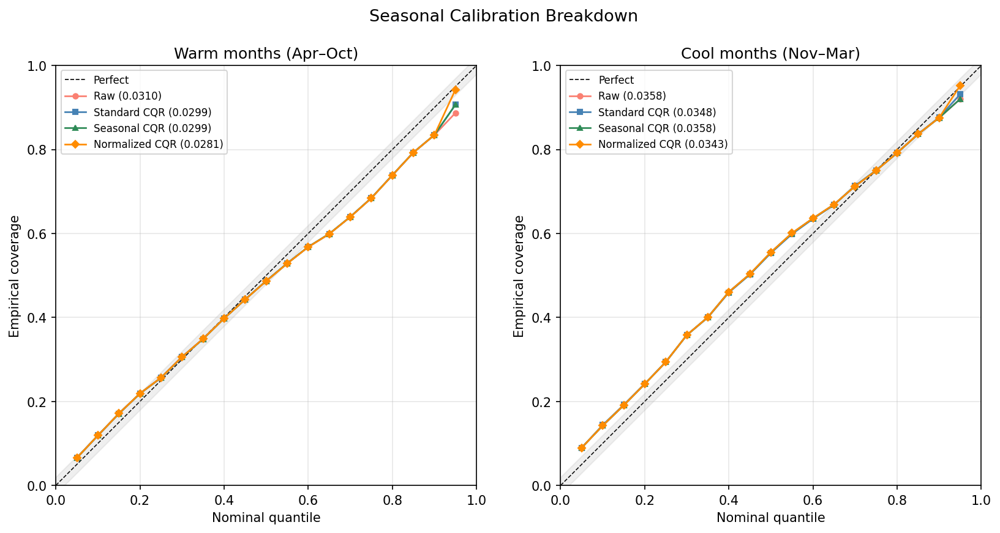

---

## Methodology Notes

### Spec Compliance

This pipeline implements F0329Bridge_Spec (Batch 8) + F0329MILP_Spec (Batch 17). Key changes from the old FF0326 architecture:

| Area | Old (FF0326) | New (F0329) |
|------|--------------|-------------|
| Load uncertainty | Fixed uplift (5% billing, 2% non-billing) | Seasonal σ Gaussian scenarios (σ=MAPE×√(π/2)) |
| MILP architecture | 365×24 direct full-year solve | Two-layer (Layer A rep-day design + Layer B daily rolling) |
| Bridge outputs | 4 rolling packages | 5 rolling + 5 repday + truth package |
| Cases | C0–C3 (4 cases) | C0–C3 + C_PFI (5 cases) |
| Filenames | `full_year_milp_ingest_*` | `rolling_da_input_*` (canonical) |

### Canonical File Names (Legacy Alias Map)

| Old (FF0326) | New (F0329) |
|-------------|------------|
| `full_year_milp_ingest_pvdet_loaddet.parquet` | `rolling_da_input_pvdet_loaddet.parquet` |
| `full_year_milp_ingest_pvprob_loaddet.parquet` | `rolling_da_input_pvprob_loaddet.parquet` |
| `full_year_milp_ingest_pvdet_loadpert.parquet` | `rolling_da_input_pvdet_loadunc.parquet` |
| `full_year_milp_ingest_pvprob_loadpert.parquet` | `rolling_da_input_pvprob_loadunc.parquet` |
| `load_perturbation_manifest.parquet` | `load_uncertainty_manifest.parquet` |

### Frozen Parameters (F0329MILP_Spec §5)

| Parameter | Value | Unit |
|-----------|-------|------|
| η_ch = η_dis | 0.95 | — |
| SOC_min | 0.10 | fraction of E_B |
| SOC_max | 0.90 | fraction of E_B |
| C_B_P | 11,944 | NTD/kW |
| C_B_E | 7,738 | NTD/kWh |
| c_basic_s | 223.6 | NTD/kW-month (summer) |
| c_basic_ns | 166.9 | NTD/kW-month (non-summer) |
| m_over_10 / m_over_gt10 | 2 / 3 | × c_basic |
| RE_target | 0.20 | 20% RE20 requirement |
| c_TREC | 4.63 | NTD/kWh |
| CRF_BESS | 0.09634 | 15 yr, r=5% |
| PV_UB | 2,687 | kW (fixed installed) |
| PWL b_k | [0, 0.1, 0.3, 0.6, 0.8] | fraction of E_B |
| PWL λ_k | [0.97, 1.61, 2.58, 3.87] | NTD/kWh |

---

## Forecast Thesis Figures

### Fig 1 — Quantile Fan Chart (3 Representative Days)

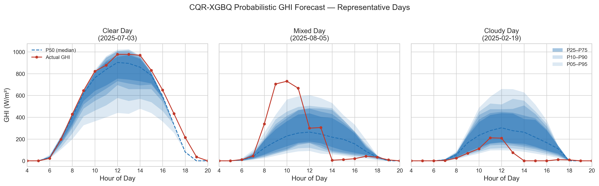

### Fig 2 — Reliability Diagram (Calibration Proof)

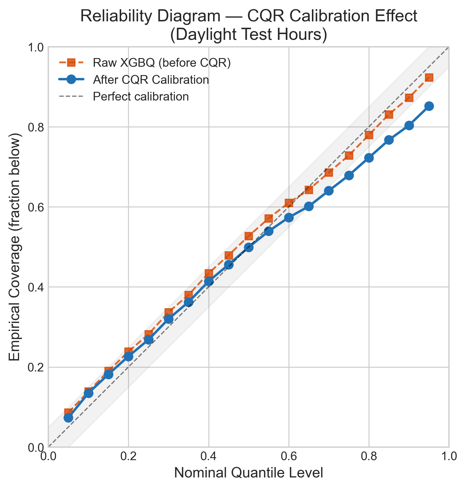

### Fig 3 — NWP Ablation (Impact of Weather Forecasts)

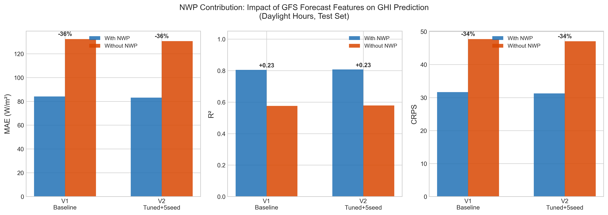

### Fig 4 — Per-Season Comparison with Pieter's RNN-LSTM

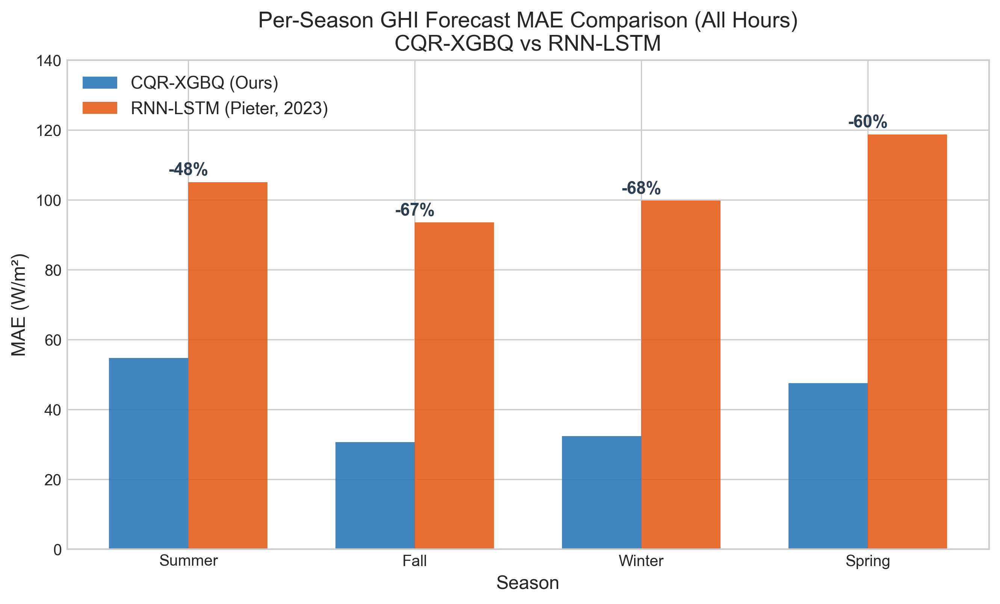

### Fig 5 — Feature Importance (Top 20)

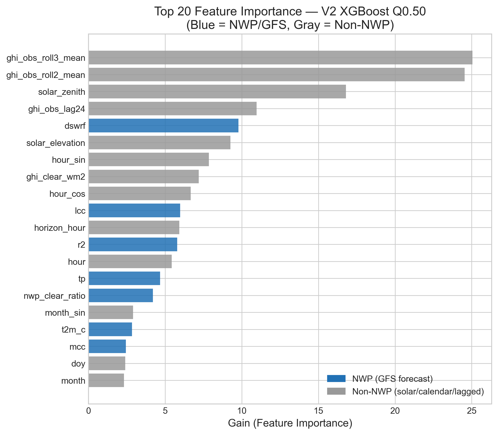

### Fig 6 — Error Heatmap (Hour × Month)

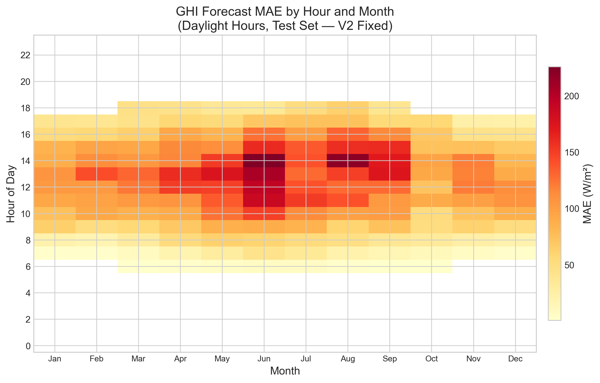

### Fig 7 — Scatter: Predicted vs Actual GHI

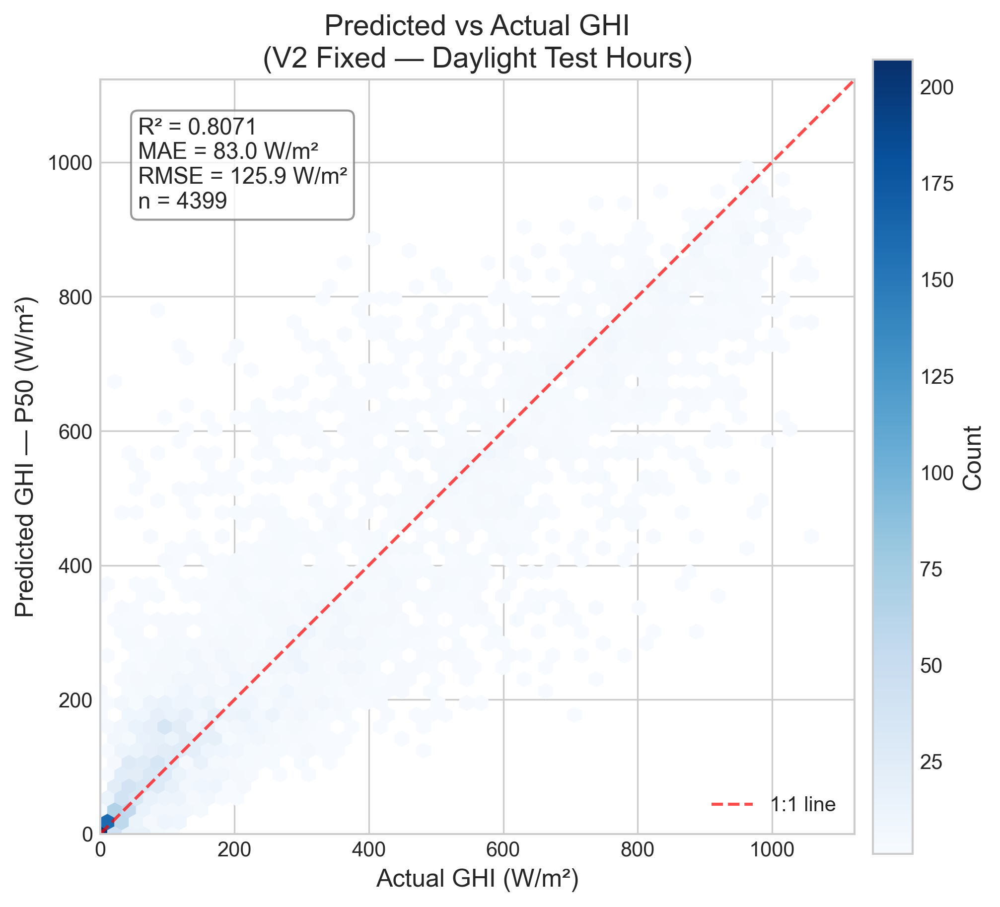

---

## Calibration Figures

**Reliability Diagram — Raw vs Normalized CQR:**
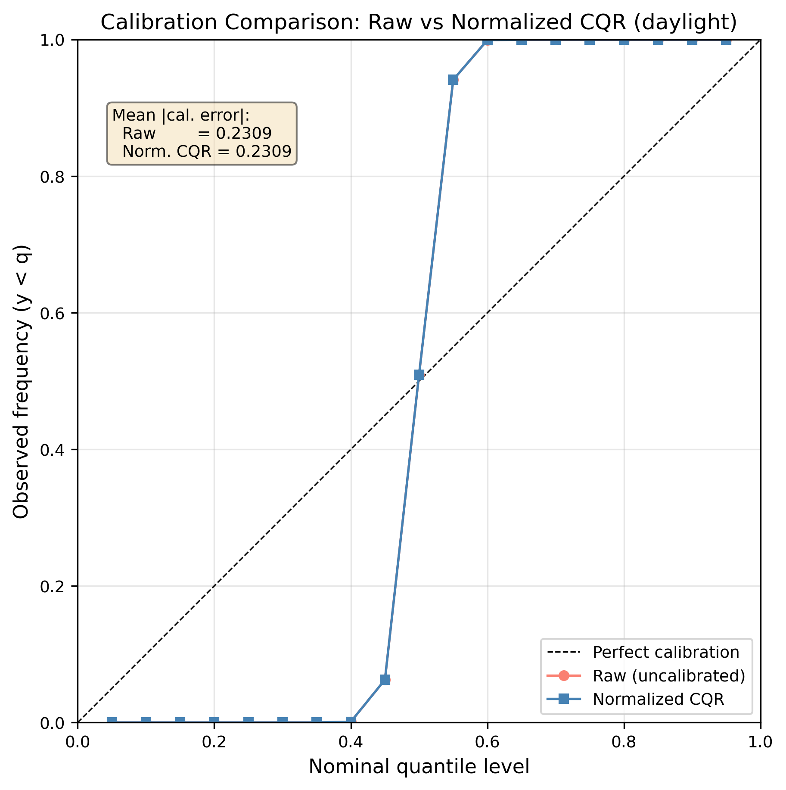

**PIT Histograms (All Test / Daylight / Critical Hours):**
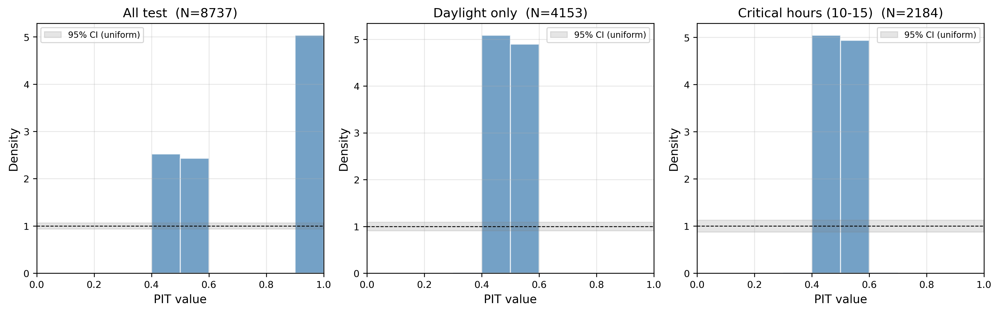

**Hourly Calibration (PICP80 / ACE80 / Lower Tail / MPIW):**
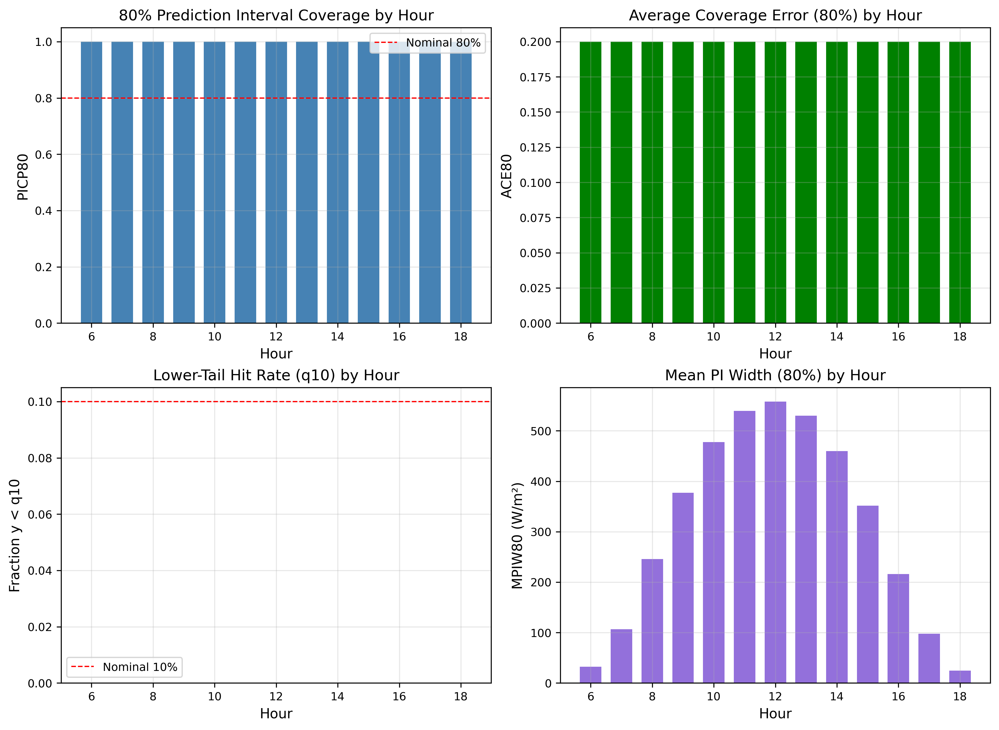

---

## Scenario Generation Diagnostics

**Scenario Cloud vs Medoids (3 Representative Days):**
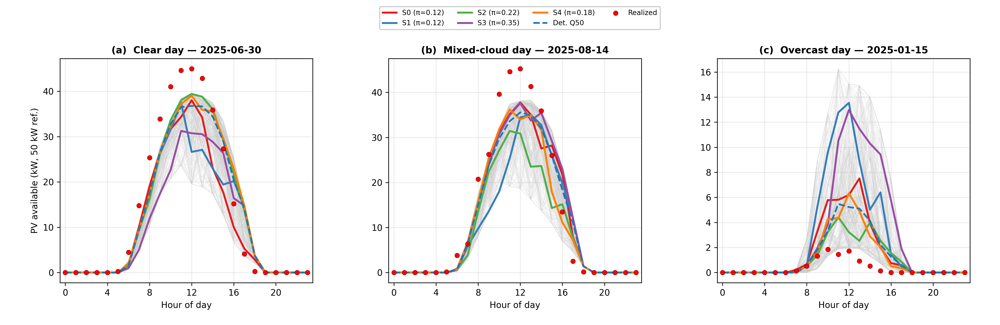

**Scenario Reduction Detail (Mixed-Cloud Day):**
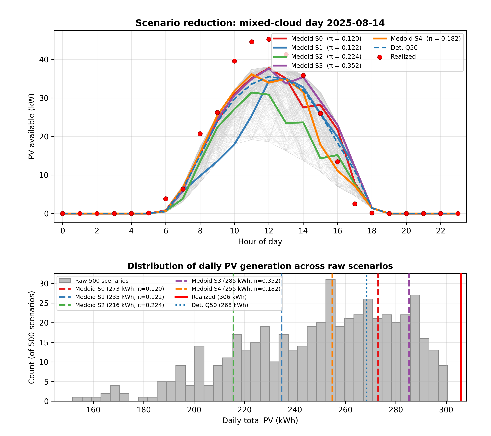

**Billing-Hour Risk Diagnostics:**
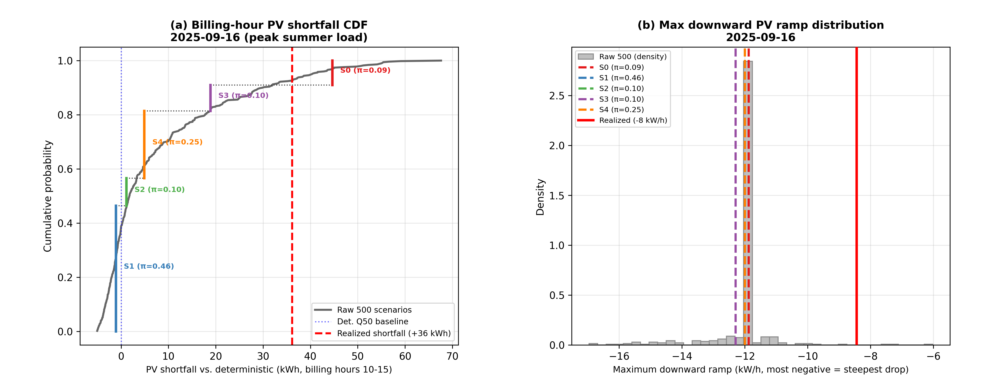

---

## Sample Results (C0 / C1 / C_PFI — Layer A Design + Layer B Replay)

| Case | CC* (kW) | P_B* (kW) | E_B* (kWh) | J_A (M NTD) | Replay (M NTD) | RE% | OC Months |
|------|----------|-----------|------------|-------------|----------------|-----|-----------|
| C0 (det PV + det load) | 3200 | 800 | 2400 | 85.22 | 102.57 | 15.5% | 9 |
| C1 (prob PV + det load) | 3200 | 600 | 2400 | 97.88 | 101.95 | 15.4% | 9 |
| C2 (det PV + load unc) | 3200 | 800 | 2400 | 99.76 | 102.55 | 15.5% | 9 |
| C3 (prob PV + load unc) | 3200 | 600 | 2400 | 112.44 | 101.92 | 15.4% | 9 |
| C_PFI (perfect forecast) | 3200 | 600 | 2400 | 95.82 | 101.74 | 15.4% | 9 |

**Value of probabilistic PV (C1 vs C0):** −0.62 M NTD/year (−0.6%) — probabilistic PV information reduces annual cost by selecting a smaller battery (600 kW vs 800 kW) at equal CC.

**Research finding:** C_PFI replay (101.74 M) is close to C1 replay (101.95 M), suggesting that probabilistic PV forecasts capture most of the value of perfect information for BESS sizing decisions.

*Note: RE% < 20% indicates T-REC shortfall included in replay total. Synthetic pvlib clear-sky data used here — results will change with real CWA/NWP forecast inputs.*

### Computational Performance (Gurobi 13.0.1, single thread)

| Case | Layer A — grid search (392 candidates) | Mean per candidate | Layer B — 365-day rolling | Mean per day |
|------|----------------------------------------|--------------------|---------------------------|--------------|
| C0 | 35.9 s | 0.09 s | 0.6 s | 1.6 ms |
| C1 | 239.2 s (~4 min) | 0.61 s | 1.5 s | 4.2 ms |
| C2 | 180.1 s (~3 min) | 0.46 s | 1.6 s | 4.5 ms |
| C3 | 457.3 s (~7.6 min) | 1.17 s | 2.3 s | 6.2 ms |
| C_PFI | 64.0 s (~1 min) | 0.16 s | 0.5 s | 1.3 ms |

Layer A time scales with scenario count per repday (C3 uses 10 joint PV×load scenarios vs. 1 for C0). Layer B is fast in all cases because each daily solve is a 24-variable LP under fixed design.

---

## MILP Thesis Figures (Generated by `milp_figures_fullyear.py`)

### Fig 1 — Optimal Sizing: CC*, P_B*, E_B* (All 5 Cases)

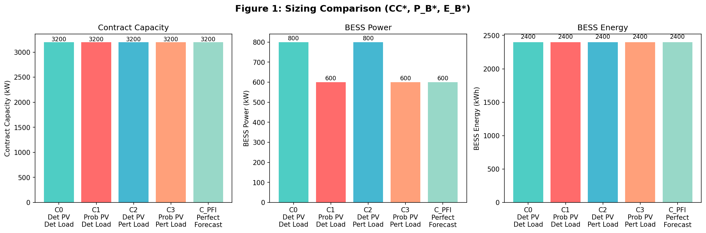

### Fig 2 — Annual Replay Total Cost (All 5 Cases)

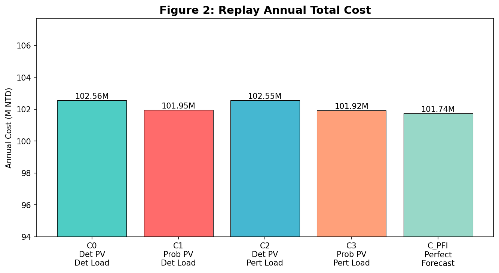

### Fig 3 — Over-Contract Fee & Worst-Month Bill

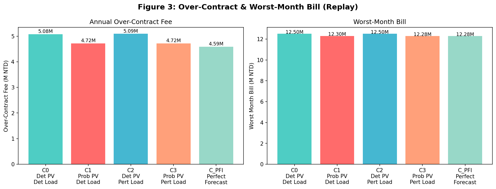

### Fig 4 — RE20 Achievement & T-REC Shortfall

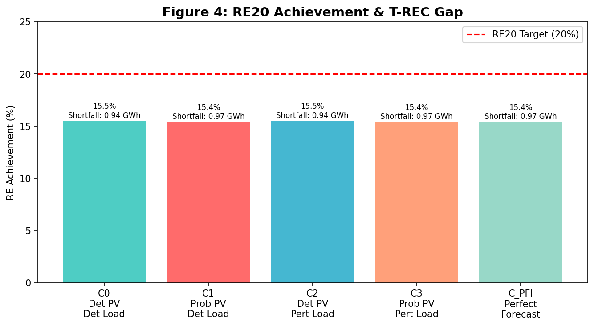

All cases achieve ~15.4% RE — below the 20% target. The T-REC shortfall (~940–970 MWh/year) is purchased at 4.63 NTD/kWh. The installed PV (2,687 kW) is physically constrained by the campus rooftop and cannot generate sufficient energy to reach RE20 unassisted.

### Fig 5 — Chronological Dispatch Trace (July Week, Truth)

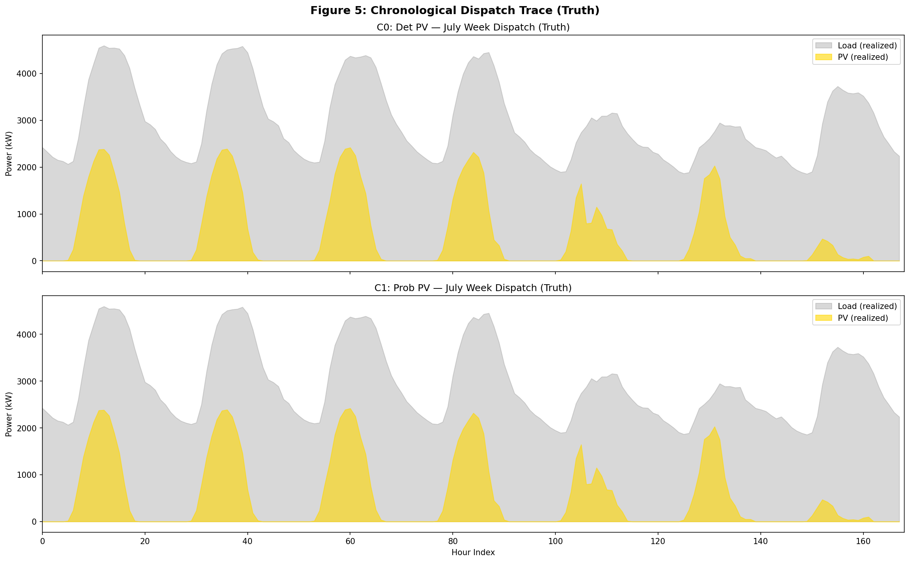

### Fig 6 — Monthly Bill Breakdown (All 5 Cases)

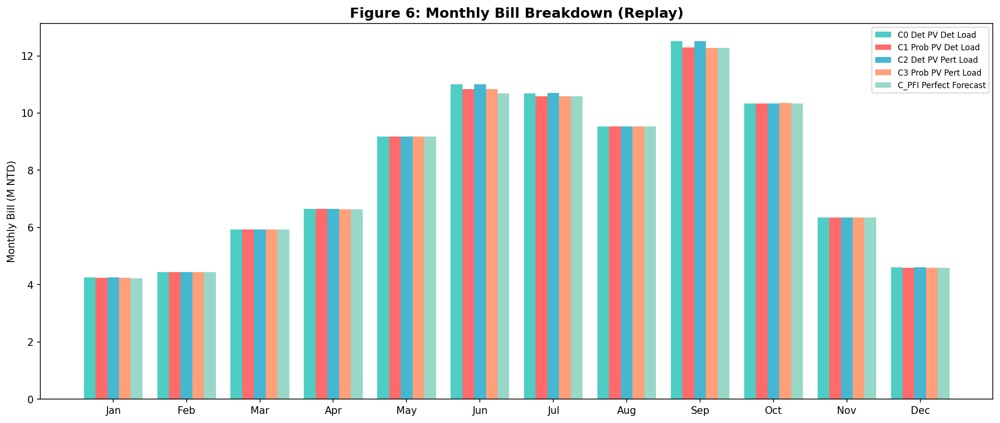

### Fig 7 — Layer A Design Estimate vs. Layer B Replay Gap

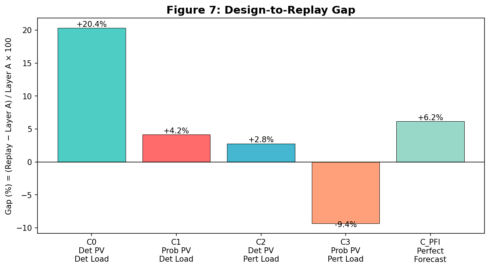
